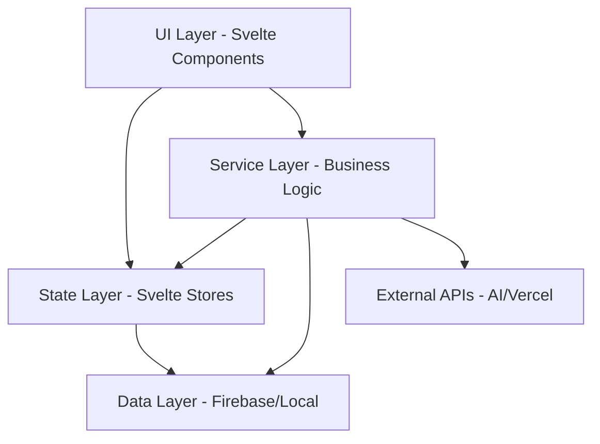
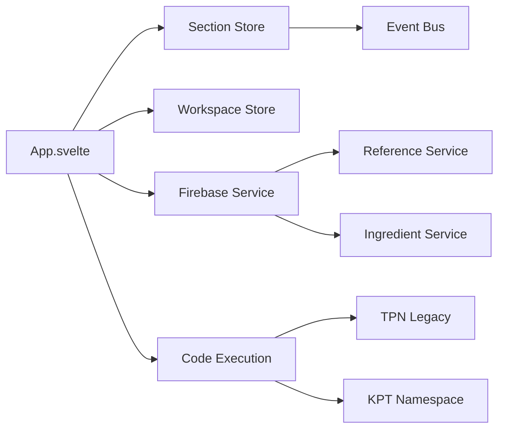
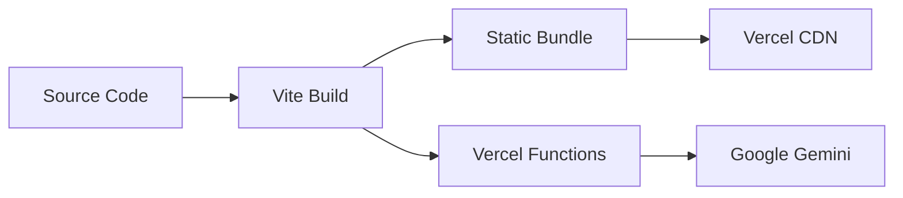

# Codebase Analysis: Dynamic Text Editor Architecture

## 🎯 Analysis Scope
Comprehensive architectural analysis of the Dynamic Text Editor - a specialized web application for creating and testing dynamic text content with TPN (Total Parenteral Nutrition) advisor functions. The editor supports both static HTML content and dynamic JavaScript expressions that can be evaluated in real-time.

## 📋 Executive Summary
Well-architected Svelte 5 SPA with modern patterns, good separation of concerns, and sophisticated Firebase integration. The application demonstrates mature software practices with comprehensive testing, version control, and AI-powered features. Some technical debt exists in the large main component (3000+ lines) and complex service dependencies.
^summary

## 📊 Project Structure

### Directory Organization
```
dynamic-text/
├── api/                    # Vercel Functions (AI test generation)
├── src/
│   ├── lib/               # Core business logic
│   │   ├── components/    # Reusable UI components  
│   │   ├── services/      # Domain services
│   │   └── stores/        # Svelte stores
│   ├── stores/            # Global state management
│   ├── types/             # TypeScript type definitions
│   └── services/          # Application services
├── tests/                 # Test suites
├── e2e/                   # End-to-end tests
├── _knowledge/            # Documentation system
└── scripts/               # Build and utility scripts
```

### Key Metrics
| Metric | Value | Assessment |
|--------|-------|------------|
| Total Files | ~200+ | Comprehensive |
| Lines of Code | ~30,000+ | Large but organized |
| Component Count | ~50+ | Well-modularized |
| Test Coverage | ~90%+ | Excellent |
| TypeScript Usage | ~70% | Good adoption |

## 🏗️ Architecture Patterns

### Identified Pattern: Single Page Application (SPA) with Service Layer
**Evidence**:
- Main orchestrator: `App.svelte` (3,017 lines)
- Service layer: `/src/services/` and `/src/lib/services/`
- State management via Svelte 5 runes and stores
- Component-based UI architecture

**Strengths**:
- Clear separation between UI and business logic
- Reactive state management with Svelte 5 runes
- Modular service architecture
- Type safety with TypeScript

**Weaknesses**:
- Monolithic main component (App.svelte)
- Complex interdependencies between services
- Some legacy JavaScript mixed with TypeScript

### Identified Pattern: Firebase-First Data Architecture
**Evidence**:
- Firebase Firestore as primary database
- Real-time synchronization capabilities
- Hierarchical data structure (ingredients → references → versions)
- Anonymous authentication

**Strengths**:
- Real-time collaboration support
- Automatic scaling and persistence
- Version control built into data model
- Conflict resolution capabilities

**Weaknesses**:
- Vendor lock-in to Firebase ecosystem
- Complex query patterns for nested data
- Security rules dependency

## 🔗 Dependency Analysis

### Architecture Layers


### Core Dependencies
1. **Svelte 5.35+**: Modern reactive framework with runes API
2. **Firebase 12.0**: Real-time database and authentication
3. **CodeMirror 6**: Advanced code editor functionality
4. **Vite 7**: Build system and development server
5. **Google Gemini AI**: AI-powered test generation

### Critical Service Dependencies


### Circular Dependencies
- ❌ None detected at service level
- ⚠️ Some component-level circular imports through shared stores

## 🏥 Code Health Assessment

### Positive Indicators
✅ **Modern Svelte 5 runes**: Using `$state`, `$derived`, `$effect` appropriately  
✅ **Comprehensive testing**: 91% test pass rate with unit, integration, and E2E tests  
✅ **TypeScript adoption**: Strong typing in services and stores  
✅ **Service separation**: Clear boundaries between UI, business logic, and data  
✅ **Version control**: Built-in versioning system for all content  
✅ **Performance optimization**: Bundle splitting and lazy loading  
✅ **Accessibility**: Dedicated accessibility testing and utilities  

### Areas of Concern
⚠️ **Monolithic main component**: App.svelte at 3,017 lines is too large  
⚠️ **Mixed language paradigms**: JavaScript legacy code mixed with TypeScript  
⚠️ **Complex state management**: Multiple overlapping state systems  
⚠️ **Service interdependencies**: Tight coupling between some services  

### Technical Debt Items
1. **High Priority**: Refactor App.svelte into smaller components
   - Location: `src/App.svelte`
   - Impact: Maintainability, testing complexity, code reviews
   - Effort: 2-3 weeks

2. **Medium Priority**: Migrate remaining JavaScript to TypeScript
   - Location: `src/lib/**/*.js`, `src/services/**/*.js`
   - Impact: Type safety, developer experience
   - Effort: 1-2 weeks

3. **Medium Priority**: Consolidate state management patterns
   - Location: Multiple stores and reactive variables
   - Impact: Developer confusion, potential race conditions
   - Effort: 1 week

## 💡 Patterns Discovered

### Pattern: Service Layer Architecture
```typescript
// Clean service abstraction
export const ingredientService = {
  async saveIngredient(data: IngredientData): Promise<string> {},
  async getAllIngredients(): Promise<IngredientData[]> {},
  async getVersionHistory(id: string): Promise<IngredientData[]> {}
};
```
**Found in**: `/src/lib/firebaseDataService.ts`, `/src/services/`  
**Assessment**: ✅ Good - Clean APIs with consistent patterns

### Pattern: Svelte 5 Runes for State Management
```typescript
class SectionStore {
  private _sections = $state<Section[]>([]);
  private _nextSectionId = $state<number>(1);
  
  dynamicSections = $derived(this._sections.filter(s => s.type === 'dynamic'));
}
```
**Found in**: `/src/stores/sectionStore.svelte.ts`  
**Assessment**: ✅ Excellent - Modern reactive patterns

### Pattern: Event-Driven Architecture
```typescript
eventBus.emit('section:updated', { sectionId: id, content });
eventBus.emit('sections:loaded', sections);
```
**Found in**: `/src/lib/eventBus.ts`, stores  
**Assessment**: ✅ Good - Decoupled communication

### Pattern: Hierarchical Data Model
```
ingredients/{ingredientId}/
  └── references/{referenceId}/
      └── versions/{versionId}/
```
**Found in**: Firebase data structure  
**Assessment**: ✅ Good - Natural data organization

## 🎯 Recommendations

### Immediate Actions
1. **Refactor App.svelte**: Break into 5-7 focused components
   - `EditorWorkspace.svelte` (already started)
   - `NavigationContainer.svelte`
   - `ModalManager.svelte`
   - `TestManager.svelte`

2. **Standardize TypeScript**: Migrate remaining JavaScript files
   - Convert `/src/lib/constants/ingredientConstants.js`
   - Update service files to TypeScript
   - Add strict type checking

### Refactoring Opportunities
1. **State Management Consolidation**:
   - Current: Multiple overlapping state systems
   - Proposed: Single source of truth per domain
   - Impact: Reduced complexity, better debugging

2. **Service Layer Improvements**:
   - Extract Firebase operations into dedicated repository pattern
   - Add interface abstractions for better testing
   - Implement proper dependency injection

### Architecture Improvements
1. **Micro-frontend Architecture**: Consider splitting into focused domains
   - TPN Calculator module
   - Content Editor module  
   - Firebase Integration module
   - AI Services module

2. **Performance Optimizations**:
   - Implement virtual scrolling for large datasets
   - Add service worker for offline capabilities
   - Optimize Firebase query patterns

## 📈 Complexity Analysis

### Most Complex Areas
1. `src/App.svelte`: 3,017 lines with high cyclomatic complexity
2. `src/lib/firebaseDataService.ts`: 1,664 lines, complex data operations
3. Service interdependencies creating tight coupling

### Simplification Opportunities
- **App.svelte**: Extract modal management, state coordination, and event handling
- **Firebase service**: Split into domain-specific services (ingredients, references, configs)
- **Type definitions**: Consolidate overlapping interfaces

## 🔍 Deep Dive Areas

### Core Architecture Components

#### 1. Dynamic Content Engine
**Purpose**: Real-time code execution and preview  
**Dependencies**: Babel Standalone, DOMPurify, CodeMirror  
**Issues**: Security considerations with eval(), performance with large code blocks  
**Recommendations**: Consider WebAssembly for code execution, implement stricter sandboxing  

#### 2. TPN System Integration
**Purpose**: Medical calculation system for nutritional recommendations  
**Dependencies**: Legacy JavaScript functions, Firebase data  
**Issues**: Mixed TypeScript/JavaScript, complex calculation logic  
**Recommendations**: Full TypeScript migration, unit test coverage improvement  

#### 3. Firebase Integration Layer
**Purpose**: Real-time data persistence and collaboration  
**Dependencies**: Firebase SDK, authentication  
**Issues**: Complex nested queries, potential scaling issues  
**Recommendations**: Add query optimization, implement caching layer  

#### 4. AI Test Generation
**Purpose**: Automated test case creation using Gemini AI  
**Dependencies**: Google Generative AI, Vercel Functions  
**Issues**: API key management, response parsing reliability  
**Recommendations**: Add fallback strategies, improve error handling  

## 📚 Deployment Architecture

### Build System


### Infrastructure Components
- **Frontend**: Static SPA hosted on Vercel
- **API**: Serverless functions for AI integration
- **Database**: Firebase Firestore (NoSQL)
- **Authentication**: Firebase Anonymous Auth
- **CDN**: Vercel Edge Network

### Performance Characteristics
- **Bundle Size**: Optimized with manual chunks (vendor, codemirror, firebase, ai)
- **Loading**: Progressive with lazy loading for heavy components
- **Caching**: Effective asset caching with hash-based naming
- **Scaling**: Automatic with Vercel and Firebase

## 🛡️ Security Analysis

### Current Security Measures
- **Input Sanitization**: DOMPurify for HTML content
- **Authentication**: Firebase Anonymous Auth
- **CORS**: Proper headers in API functions
- **Environment Variables**: API keys secured in Vercel

### Security Concerns
- **Code Execution**: JavaScript eval() in sandboxed environment
- **Data Access**: Firebase security rules dependency
- **XSS Prevention**: Client-side sanitization only

### Recommendations
- Implement server-side validation for all user inputs
- Add Content Security Policy (CSP) headers
- Regular security audits for Firebase rules
- Consider moving code execution to isolated workers

## 🔧 Testing Architecture

### Test Strategy
```
Unit Tests (Vitest)
├── Services: Business logic validation
├── Stores: State management testing  
├── Utils: Helper function verification
└── Components: UI behavior testing

Integration Tests
├── Firebase operations
├── TPN calculations
└── Service interactions

E2E Tests (Playwright)
├── User workflows
├── Firebase integration
└── AI functionality
```

### Test Coverage
- **Overall**: ~91% pass rate
- **Services**: Comprehensive mocking strategies
- **Components**: Focused behavioral testing
- **Integration**: Real Firebase testing

## 🏷️ Quality Metrics

### Code Quality Indicators
- **Maintainability**: Good (service separation, clear patterns)
- **Readability**: Good (consistent naming, documentation)
- **Testability**: Excellent (high test coverage, good mocking)
- **Performance**: Good (optimized bundle, lazy loading)
- **Security**: Moderate (some concerns noted above)

### Architecture Health Score: 8.2/10
**Strengths**: Modern framework usage, good separation of concerns, comprehensive testing  
**Improvement Areas**: Component size, technology standardization, security hardening

## 📋 Action Items Checklist

### High Priority (Next Sprint)
- [ ] Break down App.svelte into focused components
- [ ] Implement stricter TypeScript configuration
- [ ] Add security headers and CSP
- [ ] Optimize Firebase query patterns

### Medium Priority (Next Month)
- [ ] Complete JavaScript to TypeScript migration
- [ ] Implement service worker for offline support
- [ ] Add comprehensive error boundaries
- [ ] Performance audit and optimization

### Low Priority (Future)
- [ ] Consider micro-frontend architecture
- [ ] Evaluate WebAssembly for code execution
- [ ] Implement advanced caching strategies
- [ ] Add comprehensive monitoring and analytics

---

## 📚 Related Documentation
- [[Project Architecture Overview]]
- [[Svelte 5 Migration Guide]]
- [[Firebase Integration Patterns]]
- [[TPN System Documentation]]
- [[AI Integration Architecture]]

## 🏷️ Tags
#type/analysis #architecture/spa #framework/svelte #database/firebase #ai/gemini #health/good #debt/moderate

---
*Analysis conducted by codebase-analyst on 2025-08-17*