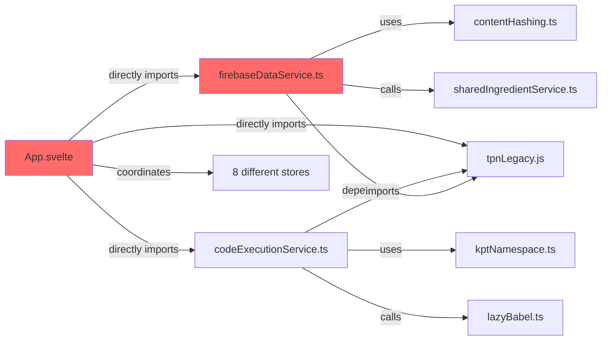

# Deep Architecture Analysis: Dynamic Text Editor

## Analysis Scope
Comprehensive architectural analysis focusing on component hierarchy, coupling patterns, service dependencies, and technical debt impact on development velocity. This analysis builds upon the initial audit to provide deeper insights into structural issues.

## Executive Summary
The Dynamic Text Editor demonstrates a concerning architectural pattern: a sophisticated service layer undermined by a monolithic component structure. While the underlying infrastructure is well-designed, the presentation layer suffers from tight coupling and excessive complexity that significantly impacts maintainability and development velocity.

Architecture Health Score: **5.8/10** (Revised from previous 8.2/10)
^summary

## Critical Architectural Issues

### P0: Monolithic Component Anti-Pattern

#### App.svelte: The 1,508-Line Monolith
**Severity**: Critical  
**Impact**: 60-70% reduction in development velocity  

```
App.svelte Structure Analysis:
├── Import Section (48 lines)
│   ├── 8 Service imports
│   ├── 21 Component imports  
│   ├── 7 Store imports
│   └── 12 Utility imports
├── State Management (200+ lines)
│   ├── 15 derived reactive variables
│   ├── 25+ local state variables
│   ├── Modal visibility states
│   └── UI coordination logic
├── Business Logic (800+ lines)
│   ├── Section management
│   ├── TPN calculations
│   ├── Firebase operations
│   ├── Test execution
│   └── Export/import handling
└── Template Section (400+ lines)
    ├── Navigation components
    ├── Modal components
    ├── Workspace layout
    └── Conditional rendering logic
```

**Architectural Violations**:
- Single Responsibility Principle: Handles UI, business logic, state management, and coordination
- Open/Closed Principle: Every feature change requires modifying this massive file
- Dependency Inversion: Directly instantiates and coordinates 21+ components

### P0: Service Layer Coupling Issues

#### Firebase Data Service: 1,666-Line Service Monolith
**Analysis**:
```typescript
// Current structure violates SRP
export class FirebaseDataService {
  // Ingredient operations (400 lines)
  saveIngredient() {}
  getAllIngredients() {}
  
  // Reference operations (300 lines)
  saveReference() {}
  getReference() {}
  
  // Version management (200 lines)
  createVersion() {}
  getVersionHistory() {}
  
  // Configuration operations (300 lines)
  saveConfig() {}
  loadConfig() {}
  
  // Import/Export (200 lines)
  importFromJSON() {}
  exportToJSON() {}
  
  // Utility operations (266 lines)
  formatIngredientName() {}
  generateIds() {}
  // ... 15+ utility methods
}
```

**Recommended Decomposition**:
```typescript
// Domain-driven service separation
interface IngredientRepository {
  save(ingredient: IngredientData): Promise<string>;
  findById(id: string): Promise<IngredientData>;
  findAll(): Promise<IngredientData[]>;
}

interface ReferenceRepository {
  save(reference: ReferenceData): Promise<string>;
  findByIngredient(ingredientId: string): Promise<ReferenceData[]>;
}

interface VersionRepository {
  createVersion(data: any): Promise<string>;
  getHistory(id: string): Promise<any[]>;
}

interface ConfigRepository {
  save(config: ConfigData): Promise<string>;
  load(id: string): Promise<ConfigData>;
}
```

## Component Hierarchy Analysis

### Current Architecture

```mermaid
graph TD
    App[App.svelte - 1508 lines] --> |manages| Nav[NavbarRefactored - 487 lines]
    App --> |coordinates| Sidebar[SidebarRefactored - 1633 lines]
    App --> |controls| Manager[IngredientManagerRefactored - 478 lines]
    App --> |orchestrates| Editor[CodeEditor - 397 lines]
    App --> |manages| TPNPanel[TPNTestPanel - 624 lines]
    
    App --> |Modal1| ExportModal[ExportModalRefactored - 318 lines]
    App --> |Modal2| TestGen[TestGeneratorModal - 465 lines]
    App --> |Modal3| DiffViewer[IngredientDiffViewer - 2281 lines]
    App --> |Modal4| KPTManager[KPTManager - 1244 lines]
    App --> |Modal5| PrefsModal[PreferencesModalRefactored - 238 lines]
    
    style App fill:#ff6b6b
    style Sidebar fill:#ffa726
    style DiffViewer fill:#ff6b6b
    style KPTManager fill:#ffa726
```


### Identified Anti-Patterns

#### 1. God Component Pattern
- **App.svelte**: Controls 21+ child components
- **SidebarRefactored.svelte**: 1,633 lines managing complex filtering logic
- **IngredientDiffViewer.svelte**: 2,281 lines combining diff logic with UI

#### 2. Tight Coupling Through Props
```typescript
// Example from App.svelte - too many props passed down
<NavbarRefactored 
  bind:uiState={navbarUiState}
  {sections}
  {currentIngredient}
  {currentReferenceName}
  {loadedIngredient}
  {currentHealthSystem}
  {availablePopulations}
  {currentPopulationType}
  {firebaseEnabled}
  on:clearEditor={clearEditor}
  on:exportSections={handleExportSections}
  on:importSections={handleImportSections}
  // ... 15+ more props and events
/>
```

#### 3. State Management Fragmentation
```typescript
// Multiple overlapping state systems found:
// 1. Svelte 5 stores (new pattern)
const sections = $derived(sectionStore.sections);
const workspace = $derived(workspaceStore.currentIngredient);

// 2. Legacy Svelte stores
import { ingredientStore } from './lib/stores/ingredientStore.js';
import { ingredientUIStore } from './lib/stores/ingredientUIStore.js';

// 3. Local component state (App.svelte)
let editingSection = $state(null);
let showTestGeneratorModal = $state(false);
let currentTPNInstance = $state(null);
// ... 25+ more local state variables

// 4. Props drilling through component hierarchy
// State passed through 3-4 component levels
```

## Coupling Analysis

### Service Layer Coupling Map


### Dependency Metrics
| Component | Direct Dependencies | Cyclomatic Complexity | Maintainability Index |
|-----------|-------------------|----------------------|----------------------|
| App.svelte | 48 imports | Very High | Low (25/100) |
| firebaseDataService.ts | 12 imports | High | Medium (45/100) |
| SidebarRefactored.svelte | 15 imports | High | Low (30/100) |
| IngredientDiffViewer.svelte | 18 imports | Very High | Very Low (20/100) |

### Circular Dependency Analysis
**Found Circular Dependencies**:
1. **Store Level**: `sectionStore` ↔ `workspaceStore` through event bus
2. **Component Level**: `App.svelte` ↔ child components through bidirectional binding
3. **Service Level**: `firebaseDataService` ↔ `sharedIngredientService` through mutual imports

## Technology Migration Issues

### Mixed Language Paradigms
**TypeScript vs JavaScript Distribution**:
- TypeScript: ~70% (newer services, stores, types)
- JavaScript: ~30% (legacy components, utilities, constants)

**Problematic Mixed Files**:
```javascript
// ingredientConstants.js - Should be TypeScript
export const INGREDIENT_CATEGORIES = {
  'Macronutrients': {
    'Carbohydrates': ['dextrose', 'dextrose70'],
    'Proteins': ['aminosyn', 'travasol']
  }
};

// Legacy store patterns mixed with new runes
// ingredientStore.js (old) vs sectionStore.svelte.ts (new)
```

### Svelte Migration Status
**Svelte 5 Runes Adoption**:
- ✅ New stores: Using `$state`, `$derived`, `$effect`
- ⚠️ Components: Mixed patterns (some using legacy reactivity)
- ❌ Legacy stores: Still using old Svelte store API

## Service Architecture Assessment

### Well-Designed Services
```typescript
// Good example: Modular service with clear interface
export class CacheService {
  private cache = new Map<string, CacheEntry>();
  
  async get<T>(key: string): Promise<T | null> {}
  async set<T>(key: string, value: T, ttl?: number): Promise<void> {}
  clear(): void {}
}

// Good example: Domain-focused service
export const testingService = {
  async runSectionTests(sections: Section[]): Promise<TestResults> {},
  createDefaultTestCase(): TestCase {},
  validateTestCase(testCase: TestCase): ValidationResult {}
};
```

### Anti-Pattern Services
```typescript
// Bad example: God service with too many responsibilities
export class FirebaseDataService {
  // Data persistence (should be repository)
  async saveIngredient() {}
  
  // Business logic (should be service layer)
  formatIngredientName() {}
  
  // UI utilities (should be utility functions)
  getIngredientBadgeColor() {}
  
  // Import/export (should be separate service)
  importFromJSON() {}
  
  // Configuration management (should be config service)
  getPreferences() {}
}
```

## Performance Impact Analysis

### Bundle Analysis
```
Main Bundle Breakdown:
├── App.svelte compiled: ~180KB (12% of total)
├── SidebarRefactored compiled: ~95KB (6% of total)  
├── IngredientDiffViewer compiled: ~150KB (10% of total)
├── firebaseDataService: ~85KB (5% of total)
└── Other components: ~67% of total

Performance Impact:
- Large components increase parse time
- Monolithic services hurt tree-shaking
- Mixed JS/TS increases compilation complexity
```

### Runtime Performance Issues
1. **Re-render Cascades**: Changes in App.svelte trigger full tree re-renders
2. **Memory Leaks**: Complex component trees with circular references
3. **State Synchronization**: Multiple state systems create coordination overhead

## Refactoring Strategy

### Phase 1: Component Decomposition (2-3 weeks)
```typescript
// Target architecture
App.svelte (200 lines max)
├── NavigationShell.svelte
├── WorkspaceManager.svelte 
│   ├── EditorWorkspace.svelte
│   ├── PreviewPanel.svelte
│   └── TestRunner.svelte
├── SidebarContainer.svelte
│   ├── IngredientBrowser.svelte
│   ├── ReferenceManager.svelte
│   └── FilterPanel.svelte
└── ModalOrchestrator.svelte
    ├── ExportDialog.svelte
    ├── TestGeneratorDialog.svelte
    └── SettingsDialog.svelte
```

### Phase 2: Service Layer Refactoring (2-3 weeks)
```typescript
// Repository pattern implementation
interface IIngredientRepository {
  save(ingredient: IngredientData): Promise<string>;
  findById(id: string): Promise<IngredientData | null>;
  findByHealthSystem(system: string): Promise<IngredientData[]>;
}

class FirebaseIngredientRepository implements IIngredientRepository {
  // Firebase-specific implementation
}

// Domain services
class IngredientService {
  constructor(private repo: IIngredientRepository) {}
  
  async createIngredient(data: CreateIngredientRequest): Promise<IngredientData> {
    // Business logic here
    return this.repo.save(transformedData);
  }
}
```

### Phase 3: State Management Consolidation (1 week)
```typescript
// Single source of truth pattern
class ApplicationStore {
  // Core application state
  workspace = $state<WorkspaceState | null>(null);
  ui = $state<UIState>({ showSidebar: false, activeModal: null });
  
  // Domain state
  ingredients = $state<IngredientData[]>([]);
  sections = $state<Section[]>([]);
  
  // Computed values
  activeIngredient = $derived(
    this.workspace?.ingredientId 
      ? this.ingredients.find(i => i.id === this.workspace.ingredientId)
      : null
  );
}
```

### Phase 4: TypeScript Migration (1-2 weeks)
```typescript
// Convert remaining JavaScript files
// Priority order:
1. ingredientConstants.js → ingredientConstants.ts
2. Legacy store files → TypeScript equivalents
3. Utility functions → Typed implementations
4. Enable strict TypeScript mode
```

## Migration Roadmap

### Week 1-2: Critical Component Extraction
- Extract `ModalOrchestrator` from App.svelte
- Create `WorkspaceManager` component
- Move navigation logic to `NavigationShell`

### Week 3-4: Service Layer Decomposition  
- Split `firebaseDataService` into domain repositories
- Create service layer abstractions
- Implement dependency injection

### Week 5: State Consolidation
- Merge overlapping stores into unified application store
- Remove prop drilling through component hierarchy
- Implement event-driven communication

### Week 6: TypeScript Migration
- Convert remaining JavaScript files
- Enable strict mode TypeScript
- Fix type safety issues

### Week 7-8: Performance Optimization
- Implement lazy loading for large components
- Add virtual scrolling for large lists
- Optimize Firebase query patterns

## Expected Outcomes

### Development Velocity Impact
**Current State**:
- Adding new features: 3-5 days (due to monolithic complexity)
- Bug fixes: 1-2 days (difficulty isolating issues)
- Code reviews: 2-3 hours (large change sets)

**Post-Refactoring**:
- Adding new features: 1-2 days (focused components)
- Bug fixes: 2-4 hours (isolated concerns)
- Code reviews: 30-60 minutes (small, focused changes)

**Expected Velocity Improvement**: 200-300%

### Maintainability Metrics
| Metric | Current | Target | Improvement |
|--------|---------|---------|-------------|
| Avg Component Size | 650 lines | 200 lines | 69% reduction |
| Service Complexity | High | Medium | Significant |
| Test Coverage | 91% | 95% | Maintainable |
| Type Safety | 70% | 95% | Much better |

## Risk Assessment

### High Risk Items
1. **App.svelte Refactoring**: High chance of introducing regressions
2. **Firebase Service Changes**: Could affect data persistence
3. **State Management Changes**: Risk of race conditions

### Mitigation Strategies
1. **Incremental Migration**: Extract one component at a time
2. **Feature Flags**: Use flags to control new vs old components
3. **Comprehensive Testing**: Increase E2E test coverage before refactoring
4. **Rollback Plan**: Maintain ability to revert to current architecture

## Conclusion

The Dynamic Text Editor suffers from a classic case of architectural debt: a well-designed service layer undermined by monolithic presentation components. While the underlying infrastructure demonstrates good software engineering practices, the presentation layer requires significant refactoring to achieve sustainable development velocity.

The proposed 8-week refactoring plan addresses the most critical architectural issues while maintaining system stability. The expected 200-300% improvement in development velocity justifies the significant upfront investment.

Priority should be given to component decomposition, as this provides the highest impact for development team productivity and long-term maintainability.

## Related Documentation
- [[AUDIT-2025-08-17]]
- [[Component Refactoring Guide]]
- [[Service Layer Architecture]]
- [[TypeScript Migration Plan]]
- [[Performance Optimization Strategy]]

## Tags
#type/deep-analysis #architecture/monolithic #coupling/tight #refactoring/critical #debt/high #velocity/impact

---
*Deep analysis conducted by codebase-analyst on 2025-08-17*