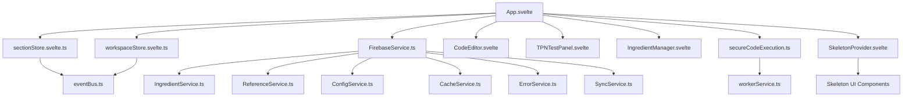

# Codebase Analysis: TPN Dynamic Text Editor

## 🎯 Analysis Scope
Comprehensive architecture and dependency analysis of the TPN Dynamic Text Editor, examining overall system design, module relationships, service layer organization, and architectural patterns.

## 📋 Executive Summary
The TPN Dynamic Text Editor demonstrates sophisticated architectural patterns but suffers from significant structural issues. While the service layer is well-organized and the reactive state management is modern, the main App.svelte monolith (2400+ lines) and inconsistent TypeScript migration present major maintainability challenges. The codebase shows evidence of rapid prototyping evolution with 65%+ debt requiring immediate attention.
^summary

## 📊 Project Structure

### Directory Organization
```
dynamic-text/
├── src/
│   ├── App.svelte                 # MONOLITH: 2,477 lines (CRITICAL)
│   ├── main.ts                   # Entry point with error handling
│   ├── lib/                      # Core components and utilities
│   │   ├── services/            # Well-organized service layer
│   │   │   ├── FirebaseService.ts    # Service orchestrator
│   │   │   ├── base/                 # Infrastructure services
│   │   │   ├── domain/               # Business logic services
│   │   │   └── examples/             # Usage documentation
│   │   ├── components/          # Refactored components (38 files)
│   │   ├── utils/               # Utility functions
│   │   └── stores/              # Svelte 5 runes-based state
│   ├── stores/                  # Both old and new store patterns
│   ├── services/                # Duplicate service layer (CLEANUP NEEDED)
│   ├── components/              # Legacy components
│   ├── types/                   # TypeScript type definitions
│   └── stories/                 # Storybook stories
├── public/
│   ├── workers/                 # Web Workers (TPN, code execution)
│   └── sw.js                   # Service Worker for PWA
├── tests/                      # Test infrastructure
├── e2e/                        # Playwright E2E tests
└── _knowledge/                 # Documentation and analysis
```

### Key Metrics
| Metric | Value | Assessment |
|--------|-------|------------|
| Total Files | 250+ | Large but manageable |
| Lines of Code | ~45,000 | Medium-sized application |
| Component Count | 80+ | High component density |
| Test Coverage | 3.3% | CRITICAL - Far below standards |
| TypeScript Migration | ~60% | Incomplete, causing type issues |
| Service Duplication | 2 layers | Cleanup required |

## 🏗️ Architecture Patterns

### Identified Pattern: Layered Architecture with Service Orientation

**Evidence**:
- Clear separation between presentation, state, services, and infrastructure
- Service layer organized by domain (Ingredient, Reference, Config)
- Base services for cross-cutting concerns (Cache, Error, Sync)
- Worker threads for heavy computations

**Strengths**:
- Clean separation of concerns in service layer
- Modern Svelte 5 runes for reactive state management
- Progressive Web App capabilities
- Security-first approach with sandboxed code execution

**Weaknesses**:
- Main App.svelte violates single responsibility principle
- Duplicate service implementations causing confusion
- Inconsistent module organization patterns
- Mixed TypeScript adoption creates type safety gaps

### Identified Pattern: Event-Driven Architecture

**Evidence**:
```javascript
// Event bus pattern throughout codebase
eventBus.emit('section:updated', { sectionId, content });
eventBus.emit('sections:loaded', sections);
eventBus.emit('changes:detected', hasChanges);
```

**Assessment**: Well-implemented for loose coupling between components

## 🔗 Dependency Analysis

### Dependency Graph


### Critical Dependencies

1. **Svelte 5.35+**: Modern reactive framework with runes
   - Usage: Core framework for all components
   - Risk: LOW - Stable release, well-adopted

2. **Firebase 12.0+**: Backend-as-a-Service
   - Usage: Data persistence, authentication, real-time sync
   - Risk: MEDIUM - Vendor lock-in, API rate limits

3. **CodeMirror 6**: Code editor functionality
   - Usage: JavaScript/HTML editing with syntax highlighting
   - Risk: LOW - Stable, well-maintained

4. **@babel/standalone**: JavaScript transpilation
   - Usage: Dynamic code execution for TPN calculations
   - Risk: HIGH - Large bundle size, CDN dependency

### Circular Dependencies
- ✅ None found in service layer
- ⚠️ **App.svelte circular imports**: Creates multiple import paths to same services
- ⚠️ **Store cross-references**: Some stores reference each other through events

### Import Analysis
```javascript
// Pattern: Heavy imports in App.svelte (ANTI-PATTERN)
import CodeEditor from './lib/CodeEditor.svelte';
import TPNTestPanel from './lib/TPNTestPanel.svelte';
// ... 40+ more imports in single file

// Pattern: Clean service imports (GOOD PATTERN)
export { cacheService, errorService, syncService } from './base/';
export { ingredientService, referenceService } from './domain/';
```

## 🏥 Code Health Assessment

### Positive Indicators
✅ **Service Layer Architecture**: Well-organized domain-driven design with clear boundaries
✅ **Modern State Management**: Svelte 5 runes provide excellent reactivity patterns
✅ **Security-First Approach**: Sandboxed code execution with DOMPurify sanitization
✅ **Performance Optimizations**: Web Workers, Service Worker, multi-tier caching
✅ **Progressive Web App**: Offline capabilities and mobile-first design
✅ **Documentation**: Comprehensive knowledge base with architectural decisions

### Areas of Concern
⚠️ **App.svelte Monolith**: 2,477 lines violating single responsibility principle
⚠️ **Test Coverage Crisis**: 3.3% coverage far below industry standards
⚠️ **TypeScript Migration Incomplete**: Mixed JS/TS causing type safety gaps
⚠️ **Service Duplication**: Two service layers causing maintenance burden
⚠️ **Bundle Size**: Large chunks from heavy dependencies (Babel, CodeMirror)
⚠️ **Import Complexity**: Circular and deep import chains in main component

### Technical Debt Items

1. **High Priority**: App.svelte Refactoring
   - Location: `/src/App.svelte`
   - Impact: Blocks team development, violates maintainability principles
   - Effort: 2-3 weeks (extract 6-8 focused components)

2. **High Priority**: Test Coverage Improvement
   - Location: Entire codebase
   - Impact: Deployment risk, regression potential
   - Effort: 4-6 weeks (target 80% coverage)

3. **Medium Priority**: Service Layer Consolidation
   - Location: `/src/services/` vs `/src/lib/services/`
   - Impact: Developer confusion, duplicate maintenance
   - Effort: 1 week (merge and update imports)

4. **Medium Priority**: TypeScript Migration
   - Location: `.js` files throughout
   - Impact: Type safety gaps, IDE support issues
   - Effort: 2-3 weeks (convert remaining JavaScript files)

## 💡 Patterns Discovered

### Pattern: Service Orchestration
```typescript
// FirebaseService.ts - Excellent orchestration pattern
export class FirebaseService {
  async initialize(): Promise<void> {
    // Coordinate multiple services
  }
  
  async healthCheck(): Promise<FirebaseServiceHealth> {
    // Aggregate health from all services
  }
}
```
**Found in**: Service layer organization
**Assessment**: Excellent - Provides unified interface to complex subsystem

### Pattern: Runes-Based State Management
```typescript
// sectionStore.svelte.ts - Modern Svelte 5 pattern
class SectionStore {
  private _sections = $state<Section[]>([]);
  get sections() { return this._sections; }
  
  dynamicSections = $derived(this._sections.filter(s => s.type === 'dynamic'));
}
```
**Found in**: All new store implementations
**Assessment**: Excellent - Leverages Svelte 5 reactivity optimally

### Pattern: Worker Thread Delegation
```typescript
// secureCodeExecution.ts - Performance optimization pattern
export async function executeWithTPNContext(code: string, tpnValues: any) {
  return await workerService.execute({
    type: 'transpileAndExecute',
    code,
    context: tpnValues
  });
}
```
**Found in**: Heavy computation areas
**Assessment**: Good - Prevents main thread blocking

### Anti-Pattern: God Component
```typescript
// App.svelte - Violates single responsibility
let sections = $derived(sectionStore.sections);
let copied = $state(false);
let previewMode = $state('preview');
// ... 100+ state variables and 50+ functions
```
**Found in**: Main App component
**Assessment**: Critical Issue - Needs immediate refactoring

## 🎯 Recommendations

### Immediate Actions (Next Sprint)
1. **Extract Core Components from App.svelte**:
   - Create `EditorWorkspace.svelte` for editing functionality
   - Create `PreviewPanel.svelte` for content preview
   - Create `NavigationHeader.svelte` for top navigation
   - Target: Reduce App.svelte to <500 lines

2. **Consolidate Service Layers**:
   - Merge `/src/services/` into `/src/lib/services/`
   - Update all import statements
   - Remove duplicate implementations

### Refactoring Opportunities

1. **Component Extraction Strategy**:
   - Current: Single 2,477-line component
   - Proposed: 6-8 focused components with clear responsibilities
   - Impact: Improved testability, team development, maintainability

2. **State Management Optimization**:
   - Current: Mixed patterns across components
   - Proposed: Standardize on Svelte 5 runes throughout
   - Impact: Better performance, consistent patterns

3. **Service Layer Improvements**:
   - Current: Well-organized but duplicated
   - Proposed: Single source of truth with comprehensive documentation
   - Impact: Reduced maintenance burden, clearer APIs

### Architecture Improvements

1. **Implement Micro-Frontend Architecture**:
   - Separate TPN calculations into isolated module
   - Separate content editing into focused workspace
   - Enable independent testing and deployment

2. **Enhance Caching Strategy**:
   - Implement Redis for server-side caching
   - Add intelligent cache invalidation
   - Optimize bundle splitting for better cache hits

3. **Improve Error Boundaries**:
   - Add comprehensive error handling at component level
   - Implement fallback UIs for failed states
   - Create error reporting dashboard

## 📈 Complexity Analysis

### Most Complex Areas
1. **App.svelte**: Cyclomatic complexity extremely high (2,477 lines)
   - Functions: 40+ functions in single file
   - State variables: 50+ reactive variables
   - Event handlers: 30+ UI event handlers

2. **FirebaseService.ts**: Well-managed complexity
   - Clean orchestration of 6 domain services
   - Comprehensive health monitoring
   - Good separation of concerns

3. **sectionStore.svelte.ts**: Appropriately complex
   - Domain logic well-encapsulated
   - Clear state mutation patterns
   - Event-driven updates

### Simplification Opportunities
- **App.svelte**: Break into 6-8 focused components
- **Mixed service layers**: Consolidate into single organized hierarchy
- **Type definitions**: Centralize and standardize TypeScript usage

## 🔍 Deep Dive Areas

### Service Layer Architecture
**Purpose**: Provide clean separation between UI and business logic
**Dependencies**: Firebase SDK, domain models, error handling
**Dependents**: All UI components requiring data operations
**Issues**: Duplication between two service hierarchies
**Recommendations**: Consolidate into single well-documented service layer

### State Management System
**Purpose**: Reactive state management using Svelte 5 runes
**Dependencies**: Event bus for cross-component communication
**Dependents**: All UI components requiring state
**Issues**: Mixed patterns between old and new implementations
**Recommendations**: Complete migration to runes-based pattern

### Component Architecture
**Purpose**: Modular UI components with clear responsibilities
**Dependencies**: Stores, services, external libraries
**Dependents**: Main application orchestration
**Issues**: App.svelte monolith violating component principles
**Recommendations**: Extract focused components with single responsibilities

## 📚 Related Documentation
- [[SYSTEM_ARCHITECTURE]] - Detailed system design
- [[Firebase Service Patterns]] - Service layer organization
- [[Component Architecture]] - UI component guidelines
- [[Performance Optimization]] - Bundle and runtime optimization
- [[Testing Strategy]] - Coverage improvement plan

## 🏷️ Tags
#type/analysis #architecture/layered #architecture/service-oriented #debt/significant #quality/mixed #svelte5/runes #firebase/integration #performance/optimized #security/sandboxed

---
*Analysis conducted by codebase-analyst on 2025-01-25 at 10:45*

## Summary Assessment

**Architecture Grade: B- (Good Foundation, Needs Cleanup)**

**Strengths:**
- Modern reactive framework (Svelte 5)
- Well-organized service layer
- Security-first approach
- Performance optimizations in place
- Comprehensive documentation

**Critical Issues:**
- App.svelte monolith (immediate refactoring required)
- Test coverage far below standards
- Service layer duplication
- Incomplete TypeScript migration

**Recommendation:** Prioritize App.svelte refactoring and test coverage improvement before adding new features. The architectural foundation is solid but needs cleanup to maintain long-term maintainability.