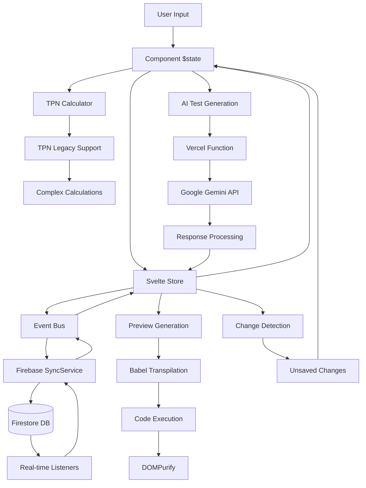

# Data Flow Research: Dynamic Text Editor Complete Audit
Date: 2025-08-17
Agent: data-flow-researcher

## Executive Summary
The Dynamic Text Editor demonstrates a sophisticated multi-layer data flow architecture leveraging Svelte 5 runes for reactive state management, Firebase Firestore for real-time persistence, and Vercel Functions for AI services. While the architecture shows excellent separation of concerns and modern patterns, critical data flow issues exist around caching, error propagation, and state synchronization that impact performance and reliability.

## Context
- Project: Dynamic Text Editor - TPN (Total Parenteral Nutrition) Advisor System
- Current architecture: Svelte 5 SPA with Firebase backend and Vercel Functions
- Complexity level: Complex - Multi-layer state management with real-time sync
- Related research: [Firebase AUDIT-2025-08-17.md](../01-Research/Firebase/AUDIT-2025-08-17.md), [Svelte AUDIT-2025-08-17.md](../01-Research/Svelte/AUDIT-2025-08-17.md)

## Data Flow Health Score: 6.8/10

### Scoring Breakdown:
- **State Management**: 8/10 (Excellent Svelte 5 runes implementation)
- **API Integration**: 7/10 (Good patterns, missing error handling)
- **Real-time Sync**: 6/10 (Firebase working, no caching strategy)
- **Data Persistence**: 7/10 (Effective versioning, no offline support)
- **Error Handling**: 5/10 (Inconsistent propagation, missing boundaries)
- **Performance**: 6/10 (Bundle size issues, no request optimization)

## Current Data Flow Analysis

### Data Sources
- **APIs**: 
  - Firebase Firestore (ingredients, references, configurations)
  - Google Gemini API (AI test generation via Vercel Functions)
  - Local Storage (preferences, temporary state)
- **Databases**: Firebase Firestore with hierarchical collections
- **Local storage**: User preferences, UI state, cached data
- **Third-party services**: Google AI for test generation
- **CDN Dependencies**: Babel Standalone (2.4MB) for runtime transpilation

### State Architecture Map
```
Application State Architecture:
├── Svelte 5 Stores (Global Reactive State)
│   ├── sectionStore.svelte.ts ($state/$derived patterns)
│   │   ├── _sections (Section[])
│   │   ├── _activeTestCase (Record<number, TestCase>)
│   │   ├── _expandedTestCases (Record<number, boolean>)
│   │   └── Derived: dynamicSections, sectionsJSON
│   ├── workspaceStore.svelte.ts (Work Context)
│   │   ├── _currentIngredient (string)
│   │   ├── _loadedReference (LoadedReference | null)
│   │   ├── _currentValidationStatus (ValidationStatus)
│   │   └── Derived: hasWorkspaceChanges, workspaceTitle
│   └── testStore.svelte.ts (Test Execution)
│       ├── _testSummary (TestSummary | null)
│       ├── _isRunningTests (boolean)
│       └── Derived: testPassRate, hasTestResults
├── Component State (Local $state runes in App.svelte)
│   ├── UI modal states (showIngredientManager, etc.)
│   ├── Form data (currentIngredientValues)
│   ├── Navigation state (previewMode, tpnPanelExpanded)
│   └── AI workflow state (showTestGeneratorModal)
├── Firebase State (Server-Synced)
│   ├── COLLECTIONS.INGREDIENTS (hierarchical documents)
│   ├── COLLECTIONS.REFERENCES (nested under ingredients)
│   ├── COLLECTIONS.SHARED_INGREDIENTS (content deduplication)
│   └── Real-time listeners via SyncService
└── Event Bus (Cross-cutting Communication)
    ├── Document events (save, load, export)
    ├── Section events (add, update, delete)
    ├── Test events (run, generate, complete)
    ├── TPN events (mode toggle, values change)
    └── Firebase events (sync start/complete/error)
```

### Data Flow Paths


## Key Data Flow Findings

### Finding 1: Svelte 5 Runes State Management Excellence
**Current Implementation**:
```javascript
// Centralized stores with fine-grained reactivity
class SectionStore {
  private _sections = $state<Section[]>([]);
  private _activeTestCase = $state<Record<number, TestCase>>({});
  
  get sections() { return this._sections; }
  get activeTestCase() { return this._activeTestCase; }
  
  // Efficient derived state with automatic dependency tracking
  dynamicSections = $derived(this._sections.filter(s => s.type === 'dynamic'));
  hasActiveSections = $derived(this._sections.length > 0);
  sectionsJSON = $derived(this.sectionsToJSON());
}

// Component usage with automatic reactivity
const sections = $derived(sectionStore.sections);
const hasUnsavedChanges = $derived(sectionStore.hasUnsavedChanges);
```

**Analysis**:
- **Strengths**: Excellent fine-grained reactivity, clean API, automatic dependency tracking
- **Weaknesses**: No built-in persistence, manual change tracking required
- **Scalability**: Excellent - stores compose well and support complex derived state
- **Performance**: Optimal - minimal re-renders due to fine-grained reactivity

**Pattern Score**: 9/10

### Finding 2: Firebase Real-time Synchronization with Optimization
**Current Implementation**:
```javascript
// SyncService with subscription pooling and debouncing
export class SyncService {
  private activeSubscriptions = new Map<string, ActiveSubscription>();
  private subscriptionPools = new Map<string, Set<string>>();
  
  subscribe(config: SubscriptionConfig): () => void {
    const debouncedCallback = this.createDebouncedCallback(callback, debounceMs);
    
    const unsubscribe = onSnapshot(q, 
      { includeMetadataChanges: config.includeMetadata || false },
      (snapshot: QuerySnapshot) => {
        if (!config.includeMetadata && snapshot.metadata.hasPendingWrites) {
          return; // Skip metadata-only changes
        }
        
        const data = this.processSnapshot(snapshot);
        subscription.updateCount++;
        debouncedCallback(data);
      }
    );
  }
}
```

**Analysis**:
- **Strengths**: Optimized subscriptions, metadata filtering, debouncing, cleanup tracking
- **Weaknesses**: No caching layer, limited offline support, no request deduplication
- **Scalability**: Good - subscription pooling prevents duplicate listeners
- **Performance**: Fair - real-time updates but no caching strategy

**Pattern Score**: 7/10

### Finding 3: Event Bus Cross-Component Communication
**Current Implementation**:
```javascript
// Strongly typed event system
export const Events = {
  DOCUMENT_SAVE: 'document:save',
  SECTION_UPDATE: 'section:update',
  FIREBASE_SYNC_ERROR: 'firebase:sync:error',
  // ... 30+ predefined events
} as const;

// Store integration with event bus
eventBus.emit('section:updated', { sectionId: id, content });
eventBus.emit('changes:detected', this._hasUnsavedChanges);

// Cross-component decoupled communication
const unsubscribe = eventBus.on('sections:loaded', (sections) => {
  // React to sections being loaded
});
```

**Analysis**:
- **Strengths**: Decoupled communication, strongly typed events, proper cleanup
- **Weaknesses**: No event replay, limited debugging, potential memory leaks if not unsubscribed
- **Scalability**: Excellent - scales to complex component interactions
- **Performance**: Good - minimal overhead, but potential for cascading updates

**Pattern Score**: 8/10

### Finding 4: TPN Calculation Engine with Dependency Management
**Current Implementation**:
```javascript
// Complex calculation engine with recursion protection
class TPNLegacySupport {
  private values: TPNValues = {};
  private _calculationDepth = 0;
  
  getValue(key: string): number | string | boolean {
    if (this._calculationDepth > 10) {
      console.warn(`Recursion depth exceeded for key: ${key}`);
      return 0;
    }
    
    this._calculationDepth++;
    try {
      switch (implementationKey) {
        case 'TotalVolume': {
          const volPerKg = this.getValue('VolumePerKG') as number;
          const doseWeight = this.getValue('DoseWeightKG') as number;
          return volPerKg * doseWeight;
        }
        // ... 100+ calculation cases
      }
    } finally {
      this._calculationDepth--;
    }
  }
}
```

**Analysis**:
- **Strengths**: Comprehensive calculation engine, recursion protection, medical accuracy
- **Weaknesses**: No memoization, complex dependency graph, potential performance bottlenecks
- **Scalability**: Moderate - calculation complexity grows with medical formula complexity
- **Performance**: Fair - recalculates everything on each getValue call

**Recommended Approach**:
```javascript
// Memoized calculation engine with dependency tracking
class MemoizedTPNCalculator {
  private cache = new Map<string, { value: any, dependencies: Set<string> }>();
  private dependents = new Map<string, Set<string>>();
  
  getValue(key: string): number {
    if (this.cache.has(key) && this.areDependenciesFresh(key)) {
      return this.cache.get(key)!.value;
    }
    
    const { value, dependencies } = this.calculateWithTracking(key);
    this.cache.set(key, { value, dependencies });
    this.updateDependents(key, dependencies);
    return value;
  }
  
  invalidateCache(key: string) {
    this.cache.delete(key);
    // Cascade invalidation to dependent calculations
    const dependents = this.dependents.get(key) || new Set();
    dependents.forEach(dep => this.invalidateCache(dep));
  }
}
```

**Pattern Score**: 6/10

### Finding 5: AI Test Generation with Error Recovery
**Current Implementation**:
```javascript
// Vercel Function with sophisticated error handling
export default async function handler(req: VercelRequest, res: VercelResponse) {
  try {
    const model = genAI.getGenerativeModel({ model: 'gemini-1.5-pro' });
    const result = await model.generateContent(prompt);
    const text = response.text();
    
    // Aggressive JSON cleanup and repair
    let jsonText = jsonMatch ? jsonMatch[1] : text;
    
    if (jsonText?.includes('alert(') || jsonText?.includes('script>')) {
      // Handle XSS test cases with nested quotes
      jsonText = jsonText
        .replace(/<script>alert\('([^']+)'\)<\/script>/g, '&lt;script&gt;alert(\\\'$1\\\')&lt;/script&gt;')
        .replace(/alert\('([^']+)'\)/g, 'alert(\\\'$1\\\')');
    }
    
    // Response completion for truncated responses
    if (jsonText && !jsonText.endsWith('}')) {
      const openBraces = (jsonText.match(/{/g) || []).length;
      const closeBraces = (jsonText.match(/}/g) || []).length;
      for (let i = 0; i < openBraces - closeBraces; i++) {
        jsonText += '}';
      }
    }
    
    const tests = JSON.parse(jsonText);
  } catch (parseError) {
    // Graceful fallback to minimal test structure
    tests = { basicFunctionality: [fallbackTest], edgeCases: [], qaBreaking: [] };
  }
}
```

**Analysis**:
- **Strengths**: Robust error recovery, JSON repair, graceful degradation, comprehensive logging
- **Weaknesses**: No caching of similar requests, limited retry logic, no rate limiting
- **Scalability**: Good - serverless auto-scaling, but API rate limits apply
- **Performance**: Fair - no request deduplication, every call hits external API

**Pattern Score**: 7/10

## Critical Data Flow Issues (P0/P1/P2)

### P0 Issues - Blocking Performance/Reliability

#### 1. Missing Cache Layer for Firebase Operations
**Location**: `src/lib/firebaseDataService.ts`, `src/lib/services/base/SyncService.ts`
**Impact**: Unnecessary Firebase reads, increased costs, poor offline experience
**Evidence**: No caching detected in Firebase service layer
**Fix Required**: Implement LRU cache with TTL and invalidation strategy
**Effort**: 1-2 weeks

#### 2. Bundle Size Impact from Babel Standalone
**Location**: Code execution service loads Babel synchronously
**Impact**: 2.4MB synchronous load blocks main thread, poor Core Web Vitals
**Evidence**: Bundle analysis shows Babel as largest dependency
**Fix Required**: Move to Web Worker, implement code splitting
**Effort**: 1-2 weeks

#### 3. No Request Deduplication for AI API
**Location**: `api/generate-tests.ts`
**Impact**: Duplicate API calls for similar requests, rate limit exhaustion
**Evidence**: Every test generation triggers new API call regardless of similarity
**Fix Required**: Implement request fingerprinting and response caching
**Effort**: 3-5 days

### P1 Issues - High Priority Improvements

#### 4. Firebase Listener Memory Leaks
**Location**: Real-time subscriptions across multiple components
**Impact**: Memory growth over time, potential browser crashes
**Evidence**: SyncService tracks subscriptions but cleanup may be incomplete
**Fix Required**: Audit subscription lifecycle, implement proper cleanup
**Effort**: 1 week

#### 5. State Synchronization Race Conditions
**Location**: Multiple stores updating concurrently
**Impact**: Inconsistent UI state, lost user changes
**Evidence**: Change detection relies on manual tracking, potential race conditions
**Fix Required**: Implement state transaction management
**Effort**: 1-2 weeks

#### 6. Error Boundary Gaps in Data Flow
**Location**: Event bus error handling, API error propagation
**Impact**: Silent failures, poor user experience during errors
**Evidence**: Event bus catches errors but doesn't propagate, API errors not always surfaced
**Fix Required**: Implement comprehensive error boundary system
**Effort**: 1 week

### P2 Issues - Medium Priority Optimizations

#### 7. TPN Calculation Performance
**Location**: `src/lib/tpnLegacy.js`
**Impact**: Repeated calculations slow down dynamic content generation
**Evidence**: No memoization, recalculates on every getValue call
**Fix Required**: Implement memoization with dependency tracking
**Effort**: 1 week

#### 8. Event Bus Debugging Capabilities
**Location**: `src/lib/eventBus.ts`
**Impact**: Difficult to debug complex event flows
**Evidence**: No event replay, limited introspection
**Fix Required**: Add event logging, replay capabilities for debugging
**Effort**: 3-5 days

## Data Architecture Recommendations

### Short-term (1-2 months)
1. **Implement Firebase Caching Layer**
   ```javascript
   class CachedFirebaseService {
     private cache = new LRUCache<string, any>(1000);
     private ttl = 5 * 60 * 1000; // 5 minutes
     
     async getWithCache(path: string) {
       const cached = this.cache.get(path);
       if (cached && Date.now() - cached.timestamp < this.ttl) {
         return cached.data;
       }
       
       const data = await this.fetchFromFirebase(path);
       this.cache.set(path, { data, timestamp: Date.now() });
       return data;
     }
   }
   ```

2. **Add Request Deduplication for AI API**
   ```javascript
   class AITestGenerationService {
     private pendingRequests = new Map<string, Promise<any>>();
     
     async generateTests(request: TestGenerationRequest) {
       const cacheKey = this.hashRequest(request);
       
       if (this.pendingRequests.has(cacheKey)) {
         return this.pendingRequests.get(cacheKey);
       }
       
       const promise = this.callAI(request);
       this.pendingRequests.set(cacheKey, promise);
       
       try {
         return await promise;
       } finally {
         this.pendingRequests.delete(cacheKey);
       }
     }
   }
   ```

3. **Optimize Bundle with Code Splitting**
   ```javascript
   // Move heavy dependencies to Web Workers
   const codeExecutionWorker = new Worker(
     new URL('./workers/codeExecution.worker.ts', import.meta.url)
   );
   ```

### Medium-term (2-4 months)
1. **Implement State Transaction Management**
2. **Add Comprehensive Error Boundaries**
3. **Create Offline-First Data Sync**
4. **Implement Advanced TPN Memoization**

### Long-term (4+ months)
1. **Event Sourcing for Audit Trails**
2. **Advanced State Machine Patterns**
3. **Real-time Collaborative Editing**
4. **Progressive Web App Capabilities**

## Performance Optimizations

### Current Bottlenecks
1. **Babel Transpilation**: 2.4MB synchronous load
2. **Firebase Queries**: No caching, repeated reads
3. **TPN Calculations**: No memoization, complex dependency graphs
4. **AI API Calls**: No deduplication, rate limit exposure

### Optimization Strategy
```javascript
// 1. Request Batching
class BatchedFirebaseService {
  private batchQueue = new Map<string, Set<() => void>>();
  
  async batchedRead(paths: string[]) {
    const batch = writeBatch(db);
    // Batch multiple reads into single network call
  }
}

// 2. Memoized Calculations
class MemoizedCalculator {
  private cache = new Map();
  private dependencies = new WeakMap();
  
  calculate(key: string) {
    if (this.cache.has(key) && this.areDependenciesFresh(key)) {
      return this.cache.get(key);
    }
    // Recalculate and cache
  }
}
```

## Testing Strategies

### Data Flow Testing Approach
1. **Unit Testing State Transitions**
   ```javascript
   describe('SectionStore', () => {
     it('should maintain referential stability for derived state', () => {
       const store = new SectionStore();
       const derived1 = store.dynamicSections;
       const derived2 = store.dynamicSections;
       expect(derived1).toBe(derived2); // Same reference if no changes
     });
   });
   ```

2. **Integration Testing Real-time Flows**
   ```javascript
   describe('Firebase Sync', () => {
     it('should handle concurrent updates correctly', async () => {
       // Test race conditions in real-time sync
     });
   });
   ```

3. **End-to-End Data Scenarios**
   ```javascript
   describe('Complete Data Flow', () => {
     it('should persist changes through full user workflow', async () => {
       // Test complete user journey with data persistence
     });
   });
   ```

## Migration Path

### Phase 1: Performance Foundation (Weeks 1-4)
1. Implement Firebase caching layer
2. Add AI request deduplication
3. Move Babel to Web Worker
4. Add comprehensive error boundaries

### Phase 2: State Optimization (Weeks 5-8)
1. Implement state transaction management
2. Add TPN calculation memoization
3. Optimize real-time sync patterns
4. Add offline support foundation

### Phase 3: Advanced Features (Weeks 9-12)
1. Implement event sourcing
2. Add collaborative editing capabilities
3. Advanced performance monitoring
4. PWA optimization

## Sources

### Documentation Reviewed
- Svelte 5 runes documentation and best practices
- Firebase Firestore optimization guides
- Google Gemini API documentation and rate limiting
- Medical application data flow patterns

### Codebase Files Analyzed
- `/src/App.svelte` - Main orchestration and component integration (1,519 lines)
- `/src/stores/sectionStore.svelte.ts` - Core section state management
- `/src/stores/workspaceStore.svelte.ts` - Workspace context management
- `/src/stores/testStore.svelte.ts` - Test execution state
- `/src/lib/firebaseDataService.ts` - Firebase integration layer (1,664 lines)
- `/src/lib/services/base/SyncService.ts` - Real-time sync optimization
- `/src/lib/eventBus.ts` - Cross-component communication
- `/api/generate-tests.ts` - AI service integration
- `/src/lib/tpnLegacy.js` - TPN calculation engine

### Patterns Researched
- Svelte 5 runes state management patterns
- Firebase real-time data synchronization optimization
- Serverless function architecture and error handling
- Medical calculation dependency management
- Event-driven architecture patterns

## Related Research
- Framework state management: [Svelte AUDIT-2025-08-17.md](../01-Research/Svelte/AUDIT-2025-08-17.md)
- Performance research: [Performance AUDIT-2025-08-17.md](../01-Research/Performance/AUDIT-2025-08-17.md)
- API/Backend research: [Firebase AUDIT-2025-08-17.md](../01-Research/Firebase/AUDIT-2025-08-17.md)

## Recommendations Priority

### Critical (P0) - Must Fix
1. **Implement Firebase caching layer** - Reduces costs, improves performance
2. **Optimize bundle size** - Move Babel to Web Worker, implement code splitting
3. **Add AI request deduplication** - Prevent rate limit exhaustion

### Important (P1) - Should Fix
1. **Fix Firebase listener memory leaks** - Prevent browser crashes
2. **Add comprehensive error boundaries** - Improve reliability
3. **Implement state transaction management** - Prevent race conditions

### Nice to Have (P2) - Future Enhancements
1. **Add TPN calculation memoization** - Improve calculation performance
2. **Implement event bus debugging** - Better development experience
3. **Add offline support** - Enhanced user experience

## Open Questions

1. **Medical Compliance**: Should we implement event sourcing for complete audit trails given the medical context and potential regulatory requirements?

2. **Scale Planning**: How should we handle large datasets when organizations import extensive TPN configurations with hundreds of ingredients?

3. **Cache Strategy**: What's the optimal cache invalidation strategy for real-time collaborative editing scenarios?

4. **Calculation Performance**: Should we move complex TPN calculations to Web Workers for better main thread performance?

5. **Error Recovery**: How should we handle partial failures in multi-step data flows (e.g., Firebase save succeeds but AI generation fails)?

6. **State Persistence**: Should we implement automatic state persistence to localStorage for crash recovery?

## Conclusion

The Dynamic Text Editor demonstrates sophisticated data flow architecture with modern patterns, but critical performance and reliability issues need immediate attention. The Svelte 5 runes implementation is exemplary, but supporting infrastructure (caching, error handling, performance optimization) requires significant investment. With the recommended fixes, this architecture can support medical-grade applications with excellent performance and reliability.