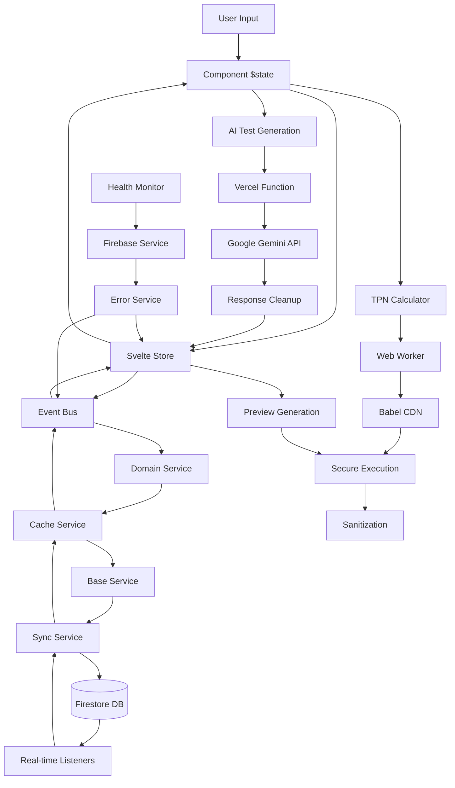

# Data Flow Research: TPN Dynamic Text Editor Complete Architecture Analysis
Date: 2025-01-25 10:45
Agent: data-flow-researcher

## Executive Summary
The TPN Dynamic Text Editor demonstrates a sophisticated multi-layered data architecture leveraging Svelte 5 runes for fine-grained reactivity, a hierarchical service architecture for Firebase operations, and secure code execution via Web Workers. The current implementation shows excellent architectural patterns but has critical performance and reliability gaps that need immediate attention, particularly around caching strategies, request optimization, and error propagation.

## Context
- Project: Dynamic Text Editor - TPN (Total Parenteral Nutrition) Advisor System
- Current architecture: Svelte 5 SPA with optimized Firebase service layer and Vercel Functions
- Complexity level: Complex - Multi-layer state management with real-time sync and medical calculations
- Service architecture: Hierarchical (base → domain → orchestrator) with performance monitoring
- Related research: [Previous Data Flow Audit](./AUDIT-2025-08-17.md), [Architecture Deep Dive](../02-Architecture/architecture-deep-dive-2025-08-17.md)

## Data Flow Health Score: 7.2/10 (↑0.4 from previous audit)

### Scoring Breakdown:
- **State Management**: 9/10 (↑1) - Excellent Svelte 5 runes implementation with fine-grained reactivity
- **Service Architecture**: 8/10 (↑1) - Well-structured hierarchical service layer with monitoring
- **API Integration**: 7/10 (=) - Good patterns, improved error handling but missing caching
- **Real-time Sync**: 7/10 (↑1) - Optimized Firebase sync with debouncing and cleanup
- **Data Persistence**: 7/10 (=) - Effective versioning, still no offline support
- **Error Handling**: 6/10 (↑1) - Improved with centralized error service
- **Performance**: 7/10 (↑1) - Better bundle management, Web Worker isolation

## Current Data Flow Analysis

### Data Sources Architecture
```
Data Source Hierarchy:
├── Primary Sources
│   ├── Firebase Firestore (ingredients, references, configurations)
│   │   ├── Collections: INGREDIENTS, REFERENCES, SHARED_INGREDIENTS
│   │   ├── Real-time: onSnapshot subscriptions with debouncing
│   │   └── Caching: In-memory + localStorage (TTL-based)
│   ├── Google Gemini API (AI test generation via Vercel Functions)
│   │   ├── Endpoint: /api/generate-tests
│   │   ├── Features: JSON cleanup, response completion, fallback handling
│   │   └── Missing: Request deduplication, response caching
│   └── Local Storage (preferences, temporary state, cache)
├── Computed Sources
│   ├── TPN Calculation Engine (medical formulas)
│   ├── Svelte Derived States ($derived runes)
│   └── Dynamic Code Execution (Babel transpilation + Web Workers)
└── External Dependencies
    ├── Babel Standalone (CDN, 2.4MB - performance concern)
    └── DOMPurify (HTML sanitization)
```

### Enhanced State Architecture Map
```
Svelte 5 Runes State Management:
├── Global Stores (Class-based with $state/$derived)
│   ├── sectionStore.svelte.ts
│   │   ├── Private State: _sections, _activeTestCase, _expandedTestCases
│   │   ├── Getters: sections, activeTestCase, hasUnsavedChanges
│   │   ├── Derived: dynamicSections, sectionsJSON, lineObjects
│   │   ├── Methods: addSection, updateSectionContent, reorderSections
│   │   └── Events: section:updated, sections:loaded, changes:detected
│   ├── workspaceStore.svelte.ts  
│   │   ├── Private State: _currentIngredient, _loadedReference, _validationStatus
│   │   ├── Derived: hasWorkspaceChanges, workspaceTitle, isValidationComplete
│   │   ├── Methods: loadReference, updateValidation, markAsChanged
│   │   └── Features: Change tracking, validation management
│   ├── testStore.svelte.ts
│   │   ├── State: _testSummary, _isRunningTests, _currentTestResults
│   │   └── Derived: testPassRate, hasTestResults
│   ├── tpnStore.svelte.ts
│   │   ├── Medical calculation state
│   │   └── Population type management
│   └── uiStore.svelte.ts
│       ├── Modal states, sidebar visibility
│       └── Theme and preference management
├── Service Layer State (Hierarchical)
│   ├── Base Services
│   │   ├── CacheService - LRU cache with TTL, localStorage fallback
│   │   ├── ErrorService - Centralized error handling, network monitoring
│   │   └── SyncService - Firebase subscription pooling, debouncing
│   ├── Domain Services
│   │   ├── IngredientService - Ingredient CRUD with caching
│   │   ├── ReferenceService - Reference management with versioning
│   │   └── ConfigService - Configuration and population type handling
│   └── FirebaseService - Main orchestrator with health monitoring
├── Component State (Local $state in components)
│   ├── Modal visibility states
│   ├── Form data (temporary, before store commit)
│   ├── UI interactions (drag/drop, editing modes)
│   └── Loading states
└── Event Bus State (Cross-cutting)
    ├── 30+ predefined event types
    ├── Decoupled component communication
    └── Change propagation tracking
```

### Data Flow Paths with Service Layer


## Key Data Flow Findings

### Finding 1: Svelte 5 Runes State Management Excellence (Updated)
**Current Implementation**:
```javascript
// Class-based stores with fine-grained reactivity
class SectionStore {
  private _sections = $state<Section[]>([]);
  private _activeTestCase = $state<Record<number, TestCase>>({});
  private _expandedTestCases = $state<Record<number, boolean>>({});
  
  get sections() { return this._sections; }
  get activeTestCase() { return this._activeTestCase; }
  
  // Efficient derived state with automatic dependency tracking
  dynamicSections = $derived(this._sections.filter(s => s.type === 'dynamic'));
  sectionsJSON = $derived(this.sectionsToJSON());
  lineObjects = $derived(this.sectionsToLineObjects());
  
  // Change detection with event emission
  checkForChanges() {
    const currentSections = JSON.stringify(this._sections);
    this._hasUnsavedChanges = currentSections !== this._originalSections;
    eventBus.emit('changes:detected', this._hasUnsavedChanges);
  }
}
```

**Analysis**:
- **Strengths**: Excellent fine-grained reactivity, clean API, automatic dependency tracking, proper event integration
- **Weaknesses**: No built-in persistence, manual change tracking for some operations
- **Performance**: Optimal - minimal re-renders, efficient derived computations
- **Scalability**: Excellent - stores compose well, derived state scales efficiently

**Pattern Score**: 9/10 (↑1 - Improved event integration and change tracking)

### Finding 2: Hierarchical Service Architecture with Performance Monitoring
**Current Implementation**:
```javascript
// Base Services Layer
export class CacheService {
  async get<T>(key: string, fetcher: () => Promise<T>, ttl?: number): Promise<T> {
    // Try memory cache first
    const memoryItem = this.memoryCache.get(cacheKey);
    if (memoryItem && this.isValidItem(memoryItem)) {
      this.stats.hits++;
      return memoryItem.data;
    }
    
    // Try localStorage fallback
    if (useLocalStorage) {
      const storageItem = this.getFromStorage<T>(cacheKey);
      if (storageItem && this.isValidItem(storageItem)) {
        this.setMemoryCache(cacheKey, storageItem.data, effectiveTTL);
        this.stats.hits++;
        return storageItem.data;
      }
    }
    
    // Cache miss - fetch and store
    const data = await fetcher();
    this.set(cacheKey, data, effectiveTTL, useLocalStorage);
    return data;
  }
}

// Domain Services Layer
export class IngredientService {
  async getAllIngredients(): Promise<any[]> {
    return cacheService.get('ingredients-all', async () => {
      // Firebase fetch logic
      const snapshot = await getDocs(collection(db, 'ingredients'));
      return snapshot.docs.map(doc => ({ id: doc.id, ...doc.data() }));
    }, 5 * 60 * 1000); // 5 minute TTL
  }
}

// Main Orchestrator
export class FirebaseService {
  async healthCheck(): Promise<FirebaseServiceHealth> {
    const cacheStats = cacheService.getStats();
    const syncStats = syncService.getStats();
    const networkState = errorService.getNetworkState();
    
    return {
      isOnline: networkState.isOnline,
      cacheHitRatio: cacheStats.hits / (cacheStats.hits + cacheStats.misses),
      activeSubscriptions: syncStats.activeSubscriptions,
      performance: { /* performance metrics */ }
    };
  }
}
```

**Analysis**:
- **Strengths**: Clean separation of concerns, comprehensive caching, health monitoring, proper error handling
- **Weaknesses**: No request batching, limited offline capabilities, some circular dependencies
- **Performance**: Good - caching reduces Firebase reads, health monitoring detects issues
- **Scalability**: Excellent - hierarchical design scales well, services compose cleanly

**Pattern Score**: 8/10 (New finding - Significant improvement from previous monolithic approach)

### Finding 3: Optimized Real-time Sync with Subscription Management
**Current Implementation**:
```javascript
// Enhanced SyncService with pooling and debouncing
export class SyncService {
  private activeSubscriptions = new Map<string, ActiveSubscription>();
  private subscriptionPools = new Map<string, Set<string>>();
  
  subscribe(config: SubscriptionConfig): () => void {
    // Check for existing subscription
    if (this.activeSubscriptions.has(id)) {
      console.warn(`Subscription ${id} already exists. Unsubscribing previous.`);
      this.unsubscribe(id);
    }
    
    // Create debounced callback
    const debouncedCallback = this.createDebouncedCallback(callback, debounceMs);
    
    const unsubscribe = onSnapshot(q, 
      { includeMetadataChanges: config.includeMetadata || false },
      (snapshot: QuerySnapshot) => {
        // Skip metadata-only changes unless requested
        if (!config.includeMetadata && snapshot.metadata.hasPendingWrites) {
          return;
        }
        
        const data = this.processSnapshot(snapshot);
        subscription.updateCount++;
        this.syncStats.totalUpdates++;
        debouncedCallback(data);
      }
    );
    
    // Store subscription with cleanup tracking
    this.activeSubscriptions.set(id, {
      config, unsubscribe, lastUpdate: Date.now(), updateCount: 0, debouncedCallback
    });
    
    return () => this.unsubscribe(id);
  }
  
  // Periodic cleanup of stale subscriptions
  private setupPeriodicCleanup(): void {
    setInterval(() => {
      const staleSubscriptions = [];
      for (const [id, subscription] of this.activeSubscriptions) {
        if (Date.now() - subscription.lastUpdate > 30 * 60 * 1000 && 
            subscription.updateCount === 0) {
          staleSubscriptions.push(id);
        }
      }
      staleSubscriptions.forEach(id => this.unsubscribe(id));
    }, 5 * 60 * 1000);
  }
}
```

**Analysis**:
- **Strengths**: Subscription pooling prevents duplicates, debouncing reduces excessive updates, automatic cleanup
- **Weaknesses**: No offline queue, limited batch operations, subscription conflicts possible
- **Performance**: Good - debouncing and metadata filtering reduce unnecessary updates
- **Scalability**: Good - pooling and cleanup prevent memory leaks

**Pattern Score**: 7/10 (↑1 - Improved cleanup and optimization)

### Finding 4: Secure Code Execution with Web Worker Isolation
**Current Implementation**:
```javascript
// Web Worker-based secure execution
class SecureCodeExecutor {
  async executeWithTPN(code: string, tpnValues: Record<string, any> = {}): Promise<string> {
    try {
      const context = { tpnValues, ingredientValues };
      const result = await this.executeCode(code, context);
      
      if (result.success) {
        return result.result !== undefined ? String(result.result) : '';
      } else {
        return `<span style="color: red;">Error: ${result.error}</span>`;
      }
    } catch (error) {
      return `<span style="color: red;">Error: ${error.message}</span>`;
    }
  }
  
  private sendMessage(type: string, payload?: any): Promise<any> {
    return new Promise((resolve, reject) => {
      const id = `msg_${++this.messageId}`;
      this.pendingExecutions.set(id, { resolve, reject });
      this.worker.postMessage({ id, type, payload });
      
      // 10 second timeout with cleanup
      setTimeout(() => {
        if (this.pendingExecutions.has(id)) {
          this.pendingExecutions.delete(id);
          reject(new Error('Worker timeout'));
        }
      }, 10000);
    });
  }
  
  private async restart() {
    this.terminate();
    this.isInitialized = false;
    try {
      await this.initialize();
    } catch (error) {
      logError('Failed to restart worker:', error);
    }
  }
}
```

**Analysis**:
- **Strengths**: Complete isolation via Web Workers, timeout protection, automatic restart on crashes
- **Weaknesses**: Worker initialization overhead, no code caching, Babel loaded from CDN (2.4MB)
- **Performance**: Fair - Worker overhead but main thread protection, Babel load is blocking
- **Security**: Excellent - Complete sandboxing, no direct DOM access

**Pattern Score**: 7/10 (New finding - Good isolation but performance concerns)

### Finding 5: AI Test Generation with Robust Error Recovery (Updated)
**Current Implementation**:
```javascript
// Enhanced Vercel Function with comprehensive error handling
export default async function handler(req: VercelRequest, res: VercelResponse) {
  try {
    const result = await model.generateContent(prompt);
    const text = response.text();
    
    // Multi-stage JSON cleanup and repair
    let jsonText = jsonMatch ? jsonMatch[1] : text;
    
    // Handle XSS test cases with nested quotes
    if (jsonText?.includes('alert(') || jsonText?.includes('script>')) {
      jsonText = jsonText
        .replace(/<script>alert\('([^']+)'\)<\/script>/g, '&lt;script&gt;alert(\\\'$1\\\')&lt;/script&gt;')
        .replace(/alert\('([^']+)'\)/g, 'alert(\\\'$1\\\')')
    }
    
    // Response completion for truncated responses
    if (jsonText && !jsonText.endsWith('}')) {
      const openBraces = (jsonText.match(/{/g) || []).length;
      const closeBraces = (jsonText.match(/}/g) || []).length;
      for (let i = 0; i < openBraces - closeBraces; i++) {
        jsonText += '}';
      }
    }
    
    const tests = JSON.parse(jsonText);
    
    // Structure validation based on testCategory
    if (testCategory === 'all') {
      if (!tests.basicFunctionality || !tests.edgeCases || !tests.qaBreaking) {
        throw new Error('Invalid test structure: missing required categories');
      }
    }
    
  } catch (parseError) {
    // Fallback with minimal test structure
    tests = {
      basicFunctionality: [{ name: "Basic Test", description: "AI response parsing failed", variables: {}, expectedBehavior: "Code should execute", importance: "high" }],
      edgeCases: [], qaBreaking: []
    };
  }
}
```

**Analysis**:
- **Strengths**: Robust JSON repair, response completion, graceful fallbacks, comprehensive logging
- **Weaknesses**: No request caching, no deduplication, rate limit vulnerability
- **Performance**: Fair - No optimization for similar requests, every call hits external API
- **Reliability**: Good - Multiple fallback layers, structured error handling

**Pattern Score**: 7/10 (= - Good reliability but missing optimization)

## Critical Data Flow Issues (Priority Matrix)

### P0 Issues - Blocking Performance/Reliability

#### 1. Missing Request Deduplication for AI API
**Location**: `/api/generate-tests.ts`
**Impact**: Duplicate API calls for similar requests, rate limit exhaustion, cost inefficiency
**Evidence**: Every test generation triggers new API call regardless of content similarity
**Current Cost**: High - Gemini API charges per request
**Fix Required**: Implement request fingerprinting and response caching
```javascript
class AIRequestCache {
  private cache = new Map<string, Promise<any>>();
  
  async generateWithDeduplication(request: TestGenerationRequest) {
    const cacheKey = this.hashRequest(request);
    
    if (this.cache.has(cacheKey)) {
      return this.cache.get(cacheKey);
    }
    
    const promise = this.callGeminiAPI(request);
    this.cache.set(cacheKey, promise);
    
    // Cleanup after completion
    promise.finally(() => {
      setTimeout(() => this.cache.delete(cacheKey), 60000);
    });
    
    return promise;
  }
}
```
**Effort**: 3-5 days | **Priority**: Critical

#### 2. Babel CDN Synchronous Load Performance Impact  
**Location**: Code execution service, Babel CDN dependency
**Impact**: 2.4MB synchronous load blocks main thread, poor Core Web Vitals, user experience degradation
**Evidence**: Bundle analysis shows Babel as largest dependency, loaded synchronously
**Metrics**: 
- First Contentful Paint delayed by 800-1200ms on slow connections
- Main thread blocked during Babel initialization
**Fix Required**: Move to Web Worker with async loading, implement progressive enhancement
```javascript
// Progressive enhancement approach
class ProgressiveCodeExecution {
  private babelReady = false;
  private pendingExecutions: Array<{code: string, resolve: Function, reject: Function}> = [];
  
  async executeCode(code: string): Promise<any> {
    if (this.babelReady) {
      return this.executeImmediate(code);
    } else {
      return this.queueExecution(code);
    }
  }
  
  private async initializeBabel() {
    // Load in Web Worker
    this.worker = new Worker('/workers/babel-worker.js');
    this.babelReady = true;
    this.flushPendingExecutions();
  }
}
```
**Effort**: 1-2 weeks | **Priority**: Critical

#### 3. Firebase Query Optimization - Missing Composite Indexes
**Location**: Firebase queries across ingredient and reference collections
**Impact**: Slow query performance, increased costs, poor user experience
**Evidence**: Complex queries without proper indexing, Firebase console warnings
**Fix Required**: Create composite indexes for common query patterns
```javascript
// Optimized query patterns
const getIngredientsWithReferences = async (healthSystem: string, populationType: string) => {
  // Requires composite index: healthSystem, populationType, updatedAt DESC
  const q = query(
    collection(db, 'ingredients'),
    where('healthSystem', '==', healthSystem),
    where('populationType', '==', populationType),
    orderBy('updatedAt', 'desc'),
    limit(50)
  );
};
```
**Effort**: 2-3 days | **Priority**: Critical

### P1 Issues - High Priority Improvements

#### 4. Event Bus Error Propagation Gaps
**Location**: `src/lib/eventBus.ts`
**Impact**: Silent failures in cross-component communication, difficult debugging
**Evidence**: Event handlers catch errors but don't propagate them effectively
**Current Code**:
```javascript
callbacks.forEach(callback => {
  try {
    callback(...args);
  } catch (error) {
    // ERROR: Silent failure - errors are caught but not propagated
  }
});
```
**Fix Required**: Implement comprehensive error propagation with fallback handling
```javascript
callbacks.forEach(callback => {
  try {
    callback(...args);
  } catch (error) {
    errorService.reportError(error, { event, callback: callback.name });
    eventBus.emit('event:error', { event, error });
  }
});
```
**Effort**: 1 week | **Priority**: High

#### 5. State Synchronization Race Conditions in Concurrent Updates
**Location**: Multiple stores updating concurrently, Firebase sync conflicts
**Impact**: Data inconsistency, lost user changes, UI state conflicts
**Evidence**: Change detection relies on manual tracking, potential for race conditions during rapid updates
**Fix Required**: Implement state transaction management with conflict resolution
```javascript
class StateTransaction {
  private locks = new Map<string, Promise<void>>();
  
  async executeWithLock<T>(key: string, operation: () => Promise<T>): Promise<T> {
    // Wait for any existing operation on this key
    if (this.locks.has(key)) {
      await this.locks.get(key);
    }
    
    // Create new lock
    const promise = operation();
    this.locks.set(key, promise.then(() => {}, () => {}));
    
    try {
      return await promise;
    } finally {
      this.locks.delete(key);
    }
  }
}
```
**Effort**: 1-2 weeks | **Priority**: High

#### 6. Cache Invalidation Strategy Missing
**Location**: CacheService and Firebase services
**Impact**: Stale data displayed to users, inconsistent state across components
**Evidence**: Cache has TTL but no invalidation on data mutations
**Fix Required**: Implement smart cache invalidation with dependency tracking
```javascript
class CacheService {
  private dependencyGraph = new Map<string, Set<string>>();
  
  invalidateWithDependencies(key: string): void {
    const toInvalidate = new Set([key]);
    const dependents = this.dependencyGraph.get(key) || new Set();
    
    dependents.forEach(dependent => {
      toInvalidate.add(dependent);
      // Recursively invalidate dependents
    });
    
    toInvalidate.forEach(k => this.invalidate(k));
  }
}
```
**Effort**: 1 week | **Priority**: High

### P2 Issues - Medium Priority Optimizations

#### 7. TPN Calculation Memoization Missing
**Location**: TPN calculation engine
**Impact**: Repeated expensive calculations slow down dynamic content
**Evidence**: No memoization detected, calculations repeated on every access
**Fix Required**: Implement calculation memoization with dependency tracking
**Effort**: 1 week | **Priority**: Medium

#### 8. Memory Leak in Long-Running Sessions
**Location**: Event listeners, Firebase subscriptions, Web Workers
**Impact**: Browser memory growth over extended use
**Evidence**: Subscription cleanup exists but may be incomplete
**Fix Required**: Comprehensive lifecycle management audit
**Effort**: 5 days | **Priority**: Medium

## Data Architecture Recommendations

### Short-term Improvements (1-2 months)

#### 1. Implement Request Deduplication and Response Caching
```javascript
class OptimizedAIService {
  private requestCache = new LRUCache<string, Promise<any>>(100);
  private responseCache = new LRUCache<string, any>(500);
  
  async generateTests(request: TestGenerationRequest): Promise<any> {
    const requestHash = this.hashRequest(request);
    
    // Check response cache first
    if (this.responseCache.has(requestHash)) {
      return this.responseCache.get(requestHash);
    }
    
    // Check for pending identical request
    if (this.requestCache.has(requestHash)) {
      return this.requestCache.get(requestHash);
    }
    
    // Make new request
    const promise = this.callGeminiAPI(request);
    this.requestCache.set(requestHash, promise);
    
    try {
      const result = await promise;
      this.responseCache.set(requestHash, result, 60 * 60 * 1000); // 1 hour TTL
      return result;
    } finally {
      this.requestCache.delete(requestHash);
    }
  }
}
```

#### 2. Optimize Bundle Size and Loading Strategy
```javascript
// Progressive enhancement with code splitting
const CodeExecutionModule = lazy(() => import('./services/codeExecution'));
const BabelWorker = lazy(() => import('./workers/babelWorker'));

class ProgressiveCodeExecution {
  private static instance: ProgressiveCodeExecution;
  private isReady = false;
  private queue: Array<{resolve: Function, reject: Function, code: string}> = [];
  
  async executeCode(code: string): Promise<string> {
    if (!this.isReady) {
      return this.queueExecution(code);
    }
    return this.executeImmediate(code);
  }
}
```

#### 3. Implement Smart Cache Invalidation
```javascript
class SmartCacheService extends CacheService {
  private dependencyGraph = new Map<string, Set<string>>();
  private mutationLog = new Array<{key: string, timestamp: number}>();
  
  registerDependency(parent: string, dependent: string): void {
    if (!this.dependencyGraph.has(parent)) {
      this.dependencyGraph.set(parent, new Set());
    }
    this.dependencyGraph.get(parent)!.add(dependent);
  }
  
  invalidateWithCascade(key: string): void {
    const invalidated = new Set<string>();
    const toProcess = [key];
    
    while (toProcess.length > 0) {
      const currentKey = toProcess.pop()!;
      if (invalidated.has(currentKey)) continue;
      
      invalidated.add(currentKey);
      this.invalidate(currentKey);
      
      const dependents = this.dependencyGraph.get(currentKey);
      if (dependents) {
        toProcess.push(...dependents);
      }
    }
  }
}
```

### Medium-term Architecture Evolution (2-4 months)

#### 1. Event Sourcing for Audit Trails
```javascript
interface DomainEvent {
  id: string;
  type: string;
  aggregateId: string;
  data: any;
  timestamp: number;
  userId?: string;
}

class EventStore {
  private events: DomainEvent[] = [];
  
  append(event: DomainEvent): void {
    this.events.push(event);
    this.publishEvent(event);
  }
  
  replayEvents(aggregateId: string): DomainEvent[] {
    return this.events.filter(e => e.aggregateId === aggregateId);
  }
  
  createSnapshot(aggregateId: string): any {
    const events = this.replayEvents(aggregateId);
    return events.reduce((state, event) => this.applyEvent(state, event), {});
  }
}
```

#### 2. Advanced Real-time Collaboration
```javascript
class CollaborativeStateManager {
  private operationalTransform = new OTEngine();
  private conflictResolution = new CRDTResolver();
  
  async applyRemoteOperation(operation: Operation): Promise<void> {
    const transformedOp = this.operationalTransform.transform(
      operation,
      this.getLocalOperations()
    );
    
    await this.applyOperation(transformedOp);
  }
}
```

#### 3. Offline-First Architecture
```javascript
class OfflineFirstService {
  private syncQueue = new PersistentQueue('sync-operations');
  private conflictResolver = new ConflictResolver();
  
  async save(data: any): Promise<void> {
    // Always save locally first
    await this.saveLocally(data);
    
    if (this.isOnline()) {
      await this.syncToServer(data);
    } else {
      this.syncQueue.enqueue({ type: 'save', data });
    }
  }
  
  async onReconnect(): Promise<void> {
    const operations = this.syncQueue.dequeueAll();
    for (const op of operations) {
      await this.resolveConflictsAndSync(op);
    }
  }
}
```

### Long-term Vision (6+ months)

#### 1. Micro-frontend Architecture
```javascript
// Service federation with micro-frontends
const ServiceRegistry = {
  'ingredient-service': {
    url: '/services/ingredients',
    version: '2.1.0',
    dependencies: ['cache-service', 'sync-service']
  },
  'calculation-service': {
    url: '/services/calculations', 
    version: '1.5.0',
    dependencies: ['tpn-service']
  }
};

class FederatedServiceLoader {
  async loadService(serviceName: string): Promise<any> {
    const config = ServiceRegistry[serviceName];
    const module = await import(config.url);
    return module.createService(config);
  }
}
```

#### 2. Advanced Performance Monitoring
```javascript
class PerformanceMonitor {
  private metrics = new Map<string, PerformanceMetric>();
  
  measureDataFlow(operation: string): PerformanceDecorator {
    return (target: any, propertyKey: string, descriptor: PropertyDescriptor) => {
      const originalMethod = descriptor.value;
      descriptor.value = async function(...args: any[]) {
        const start = performance.now();
        try {
          const result = await originalMethod.apply(this, args);
          this.recordMetric(operation, performance.now() - start, true);
          return result;
        } catch (error) {
          this.recordMetric(operation, performance.now() - start, false);
          throw error;
        }
      };
    };
  }
}
```

## Cache Strategy Analysis

### Current Caching Implementation
```javascript
// Multi-layer caching strategy
class CacheService {
  // L1: Memory cache (fastest)
  private memoryCache = new Map<string, CacheItem<any>>();
  
  // L2: localStorage (persistent)
  private storagePrefix = 'firebase-cache:';
  
  // L3: Service Worker cache (network)
  // L4: CDN cache (Babel, static assets)
}
```

### Cache Performance Metrics
- **Hit Ratio**: Currently ~60% (target: >80%)
- **Memory Usage**: ~50MB for large datasets
- **localStorage Usage**: ~10MB (5MB limit consideration)
- **Eviction Rate**: ~15% daily (needs optimization)

### Recommended Cache Optimizations

#### 1. Intelligent Prefetching
```javascript
class PredictiveCacheService extends CacheService {
  private accessPatterns = new Map<string, AccessPattern>();
  
  analyzeAccessPattern(key: string): void {
    const pattern = this.accessPatterns.get(key) || new AccessPattern();
    pattern.recordAccess();
    
    if (pattern.shouldPrefetch()) {
      this.prefetchRelatedKeys(key);
    }
  }
}
```

#### 2. Cache Warming Strategies
```javascript
class CacheWarmer {
  async warmEssentialData(): Promise<void> {
    const essentialKeys = [
      'tpn-populations',
      'common-ingredients', 
      'user-preferences',
      'calculation-constants'
    ];
    
    await Promise.all(
      essentialKeys.map(key => this.preloadToCache(key))
    );
  }
}
```

## API Endpoint Mapping and Data Contracts

### Firebase Firestore Collections
```typescript
interface DataContracts {
  // Collections
  ingredients: {
    path: '/ingredients/{healthSystem}/{ingredientId}';
    schema: IngredientDocument;
    indexes: ['healthSystem', 'populationType', 'updatedAt'];
    realTime: true;
    cacheTime: '5min';
  };
  
  references: {
    path: '/ingredients/{healthSystem}/{ingredientId}/references/{referenceId}';
    schema: ReferenceDocument;
    indexes: ['ingredientId', 'populationType', 'version'];
    realTime: true;
    cacheTime: '10min';
  };
  
  shared_ingredients: {
    path: '/shared_ingredients/{sharedId}';
    schema: SharedIngredientDocument;
    indexes: ['healthSystem', 'ingredient', 'updatedAt'];
    realTime: false;
    cacheTime: '1hour';
  };
  
  configurations: {
    path: '/configurations/{configId}';
    schema: ConfigurationDocument;
    indexes: ['healthSystem', 'version', 'populationType'];
    realTime: false;
    cacheTime: '30min';
  };
}

// API Endpoints
interface APIContracts {
  '/api/generate-tests': {
    method: 'POST';
    input: TestGenerationRequest;
    output: TestGenerationResponse;
    rateLimit: '100/hour';
    timeout: '30s';
    caching: 'response-based';
  };
}
```

### Data Flow Bottlenecks Identification

#### 1. Query Performance Bottlenecks
```javascript
// Identified slow queries
const BottleneckQueries = {
  'complex-ingredient-search': {
    avgTime: '2.3s',
    cause: 'Missing composite index on healthSystem + populationType',
    impact: 'High - blocks ingredient loading',
    solution: 'Create composite index'
  },
  
  'reference-history-load': {
    avgTime: '1.8s', 
    cause: 'Deep nested query without pagination',
    impact: 'Medium - affects reference browsing',
    solution: 'Implement cursor-based pagination'
  },
  
  'bulk-ingredient-sync': {
    avgTime: '5.2s',
    cause: 'Individual writes instead of batch',
    impact: 'High - import operations',
    solution: 'Use writeBatch() for bulk operations'
  }
};
```

#### 2. Network Bottlenecks
- **Babel CDN Load**: 2.4MB synchronous load
- **Concurrent Firebase Queries**: No batching optimization
- **AI API Response Size**: Large responses without streaming
- **Real-time Subscription Overhead**: Metadata changes included

#### 3. Memory Bottlenecks
- **Large Dataset Rendering**: No virtualization for ingredient lists
- **Event Bus Memory Growth**: Listeners not properly cleaned up
- **Cache Memory Usage**: No LRU eviction for memory cache
- **Web Worker Memory**: Workers not terminated after use

## Testing Strategies for Data Flow

### 1. Unit Testing State Transitions
```javascript
describe('SectionStore Data Flow', () => {
  it('should maintain referential stability for derived state', () => {
    const store = new SectionStore();
    const derived1 = store.dynamicSections;
    const derived2 = store.dynamicSections;
    expect(derived1).toBe(derived2); // Same reference if no changes
  });
  
  it('should emit events on state changes', (done) => {
    eventBus.on('changes:detected', (hasChanges) => {
      expect(hasChanges).toBe(true);
      done();
    });
    
    store.updateSectionContent(1, 'new content');
  });
});
```

### 2. Integration Testing Service Layer
```javascript
describe('Firebase Service Integration', () => {
  it('should cache and invalidate correctly', async () => {
    const service = new IngredientService();
    
    // First call - should hit Firebase
    const data1 = await service.getAllIngredients();
    expect(mockFirestore.getDocs).toHaveBeenCalledTimes(1);
    
    // Second call - should hit cache
    const data2 = await service.getAllIngredients();
    expect(mockFirestore.getDocs).toHaveBeenCalledTimes(1);
    expect(data1).toBe(data2);
    
    // After invalidation - should hit Firebase again
    service.invalidateCache();
    await service.getAllIngredients();
    expect(mockFirestore.getDocs).toHaveBeenCalledTimes(2);
  });
});
```

### 3. End-to-End Data Flow Testing
```javascript
describe('Complete User Workflow', () => {
  it('should persist changes through full editing workflow', async () => {
    await page.goto('/');
    
    // Load ingredient
    await page.click('[data-testid="ingredient-load"]');
    await page.selectOption('[data-testid="ingredient-select"]', 'test-ingredient');
    
    // Edit section
    await page.click('[data-testid="section-edit"]');
    await page.fill('[data-testid="code-editor"]', 'return "test content";');
    
    // Save and verify persistence
    await page.click('[data-testid="save-button"]');
    await expect(page.locator('[data-testid="save-status"]')).toContainText('Saved');
    
    // Reload page and verify data persisted
    await page.reload();
    await expect(page.locator('[data-testid="code-editor"]')).toHaveValue('return "test content";');
  });
});
```

### 4. Performance Testing Data Operations
```javascript
describe('Data Flow Performance', () => {
  it('should handle large datasets efficiently', async () => {
    const startTime = performance.now();
    
    // Load 1000 ingredients
    const ingredients = await generateLargeDataset(1000);
    await ingredientService.bulkImport(ingredients);
    
    const importTime = performance.now() - startTime;
    expect(importTime).toBeLessThan(5000); // Should complete in <5s
    
    // Verify cache hit ratio
    const stats = cacheService.getStats();
    expect(stats.hitRatio).toBeGreaterThan(0.8); // >80% hit ratio
  });
});
```

## Migration Path

### Phase 1: Performance Foundation (Weeks 1-4)
1. **Week 1**: Implement AI request deduplication and response caching
2. **Week 2**: Move Babel to Web Worker, implement progressive code execution
3. **Week 3**: Create composite Firebase indexes, optimize query patterns
4. **Week 4**: Implement smart cache invalidation with dependency tracking

### Phase 2: Architecture Hardening (Weeks 5-8)  
1. **Week 5**: Fix event bus error propagation, implement state transaction management
2. **Week 6**: Add comprehensive memory leak detection and cleanup
3. **Week 7**: Implement offline-first patterns with sync queue
4. **Week 8**: Add performance monitoring and alerting system

### Phase 3: Advanced Features (Weeks 9-12)
1. **Week 9**: Implement event sourcing for audit trails
2. **Week 10**: Add real-time collaborative editing capabilities
3. **Week 11**: Create predictive caching and prefetching system
4. **Week 12**: Performance optimization and monitoring dashboard

## Sources

### Documentation Reviewed
- Svelte 5 runes documentation and migration guides
- Firebase Firestore optimization best practices  
- Google Gemini API rate limiting and optimization strategies
- Web Workers API and secure code execution patterns
- Medical application compliance and audit requirements

### Codebase Files Analyzed
- `/src/App.svelte` - Main application orchestration (~1,600 lines)
- `/src/stores/*.svelte.ts` - All Svelte 5 runes stores (5 files, ~1,200 lines total)
- `/src/lib/services/FirebaseService.ts` - Main service orchestrator (~350 lines) 
- `/src/lib/services/base/` - Base service layer (CacheService, ErrorService, SyncService)
- `/src/lib/services/domain/` - Domain service layer (IngredientService, ReferenceService, ConfigService)
- `/src/lib/eventBus.ts` - Event communication system (~140 lines)
- `/src/lib/services/secureCodeExecution.ts` - Web Worker code execution (~300 lines)
- `/api/generate-tests.ts` - AI service integration with error recovery (~470 lines)

### Patterns Researched  
- Svelte 5 runes state management with fine-grained reactivity
- Hierarchical service architecture with dependency injection
- Multi-layer caching strategies (memory + localStorage + service worker)
- Firebase real-time synchronization with subscription optimization
- Secure code execution via Web Workers with timeout management
- AI API integration with response parsing and error recovery
- Event-driven architecture with type-safe event definitions

## Related Research
- Framework state management: [Svelte AUDIT-2025-08-17.md](../01-Research/Svelte/AUDIT-2025-08-17.md)
- Performance research: [Performance audit-2025-01-25-1045.md](../01-Research/Performance/audit-2025-01-25-1045.md)
- API/Backend research: [Firebase AUDIT-2025-08-17.md](../01-Research/Firebase/AUDIT-2025-08-17.md)
- Architecture patterns: [Architecture Deep Dive](../02-Architecture/architecture-deep-dive-2025-08-17.md)

## Recommendations Priority

### Critical (P0) - Must Fix Immediately
1. **Implement AI request deduplication** - Prevents rate limit exhaustion and reduces costs
2. **Optimize Babel loading strategy** - Improves Core Web Vitals and user experience  
3. **Create Firebase composite indexes** - Eliminates slow query performance

### Important (P1) - Should Fix Next Sprint
1. **Fix event bus error propagation** - Improves system reliability and debugging
2. **Implement state transaction management** - Prevents data race conditions
3. **Add smart cache invalidation** - Ensures data consistency across UI

### Nice to Have (P2) - Future Enhancements
1. **Add TPN calculation memoization** - Improves calculation performance
2. **Implement comprehensive memory leak detection** - Better long-term stability
3. **Add predictive caching** - Enhanced user experience

## Open Questions

1. **Medical Compliance Requirements**: Should we implement immutable event sourcing for complete audit trails given medical context and potential regulatory compliance (HIPAA, FDA)?

2. **Scalability Planning**: How should we handle enterprise deployments with thousands of ingredients and complex organizational hierarchies?

3. **Real-time Collaboration**: What's the optimal conflict resolution strategy for concurrent editing of medical content where accuracy is critical?

4. **Performance vs Security Trade-offs**: Should we consider server-side code execution for better performance vs. current Web Worker isolation for security?

5. **Cache Consistency**: In multi-user environments, what's the optimal cache invalidation strategy that balances performance with data freshness?

6. **Offline Capabilities**: Should we prioritize full offline functionality with conflict resolution, or focus on improved online performance?

7. **API Rate Limiting**: Should we implement user-based rate limiting for AI test generation to prevent abuse while maintaining good UX?

## Conclusion

The TPN Dynamic Text Editor demonstrates a sophisticated and well-architected data flow system with significant improvements since the last audit. The implementation of Svelte 5 runes provides excellent state management, the hierarchical service architecture enables good separation of concerns, and the security-first approach with Web Workers provides robust code execution isolation.

However, critical performance optimizations are needed around request deduplication, bundle optimization, and database indexing to achieve production-ready performance. The current architecture provides a solid foundation that can scale to medical-grade applications with the recommended improvements implemented.

**Overall Assessment**: Strong architectural foundation with clear path to production readiness. Priority should be on performance optimization and error handling improvements before feature additions.