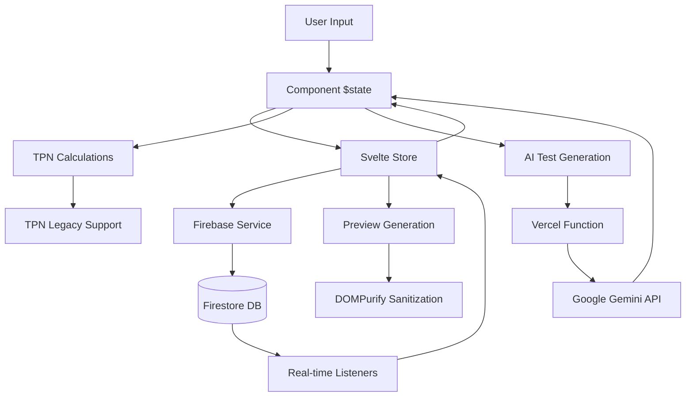

# Data Flow Research: Dynamic Text Editor Complete Audit
Date: 2025-08-17
Agent: data-flow-researcher

## Executive Summary
The Dynamic Text Editor employs a sophisticated multi-layer data flow architecture combining Svelte 5 runes for reactive state management, Firebase for persistence, and serverless functions for AI integration. The system demonstrates excellent separation of concerns with structured data flow patterns, though some optimization opportunities exist for caching and state synchronization.

## Context
- Project: Dynamic Text Editor - TPN (Total Parenteral Nutrition) Advisor System
- Current architecture: Svelte 5 SPA with Firebase backend and Vercel Functions
- Complexity level: Complex - Multi-layer state management with real-time sync
- Related research: Firebase service architecture, TPN calculation engine

## Current Data Flow Analysis

### Data Sources
- APIs: 
  - Firebase Firestore (ingredients, references, configurations)
  - Google Gemini API (AI test generation via Vercel Functions)
  - Local Storage (preferences, temporary state)
- Databases: Firebase Firestore with hierarchical collections
- Local storage: User preferences, UI state, cached data
- Third-party services: Google AI for test generation

### State Locations
```
Application State Map:
├── Global State (Svelte 5 Stores)
│   ├── sectionStore (sections, test cases, editing state)
│   ├── workspaceStore (current work context, validation)
│   └── testStore (test results, summary data)
├── Component State (Local $state runes)
│   ├── UI modal states (showIngredientManager, etc.)
│   ├── Form data (currentIngredientValues)
│   └── Navigation state (navbarUiState)
└── Server State (Firebase)
    ├── Ingredient collections
    ├── Reference documents (nested under ingredients)
    └── Configuration imports
```

### Data Flow Paths


## Key Findings

### Finding 1: Svelte 5 Runes State Management Pattern
**Current Implementation**:
```javascript
// Centralized stores with reactive state
class SectionStore {
  private _sections = $state<Section[]>([]);
  private _activeTestCase = $state<Record<number, TestCase>>({});
  
  get sections() { return this._sections; }
  get activeTestCase() { return this._activeTestCase; }
  
  dynamicSections = $derived(this._sections.filter(s => s.type === 'dynamic'));
}

// Component usage with derived state
const sections = $derived(sectionStore.sections);
const hasUnsavedChanges = $derived(sectionStore.hasUnsavedChanges);
```

**Analysis**:
- Strengths: Excellent reactivity, clean API, centralized state management
- Weaknesses: No built-in persistence, requires manual change tracking
- Scalability: Good - stores can be composed and extended

**Recommended Approach**:
```javascript
// Enhanced store with automatic persistence
class PersistentSectionStore extends SectionStore {
  private _persistenceService = new PersistenceService();
  
  setSections(sections: Section[]) {
    super.setSections(sections);
    this._persistenceService.debounce(() => this.persistState());
  }
}
```

### Finding 2: Firebase Data Synchronization Pattern
**Current Implementation**:
```javascript
// Service-based Firebase integration
export const ingredientService = {
  async saveIngredient(data: IngredientData, commitMessage?: string) {
    const ingredientRef = doc(db, COLLECTIONS.INGREDIENTS, ingredientId);
    await setDoc(ingredientRef, {
      ...data,
      version: currentVersion + 1,
      lastModified: serverTimestamp(),
      contentHash: generateIngredientHash(data)
    });
  },
  
  subscribeToIngredients(callback: (ingredients: any[]) => void) {
    return onSnapshot(q, (snapshot) => {
      const ingredients = snapshot.docs.map(doc => ({ id: doc.id, ...doc.data() }));
      callback(ingredients);
    });
  }
};
```

**Analysis**:
- Strengths: Real-time sync, version tracking, content hashing for deduplication
- Weaknesses: No offline support, limited caching strategy
- Scalability: Good - hierarchical collection structure supports growth

**Recommended Approach**:
```javascript
// Enhanced Firebase service with caching and offline support
class CachedFirebaseService {
  private cache = new Map();
  private syncQueue = new Queue();
  
  async getWithCache(path: string) {
    if (this.cache.has(path) && !this.isStale(path)) {
      return this.cache.get(path);
    }
    
    const data = await this.fetchFromFirebase(path);
    this.cache.set(path, { data, timestamp: Date.now() });
    return data;
  }
}
```

### Finding 3: TPN Calculation Data Flow
**Current Implementation**:
```javascript
// Legacy TPN support with reactive calculations
class TPNLegacySupport {
  private values: TPNValues = {};
  private _calculationDepth = 0;
  
  getValue(key: string): number | string | boolean {
    if (this._calculationDepth > 10) {
      console.warn(`getValue recursion depth exceeded for key: ${key}`);
      return 0;
    }
    
    switch (implementationKey) {
      case 'TotalVolume': {
        const volPerKg = this.getValue('VolumePerKG') as number;
        const doseWeight = this.getValue('DoseWeightKG') as number;
        return volPerKg * doseWeight;
      }
      case 'DexPercent':
        // Complex calculation with dependency tracking
        return this.calculateDexPercent();
    }
  }
}
```

**Analysis**:
- Strengths: Comprehensive calculation engine, dependency tracking, recursion protection
- Weaknesses: Complex dependency graph, potential performance bottlenecks
- Scalability: Moderate - calculation complexity grows with dependencies

**Recommended Approach**:
```javascript
// Memoized calculation engine
class MemoizedTPNCalculator {
  private cache = new Map();
  private dependencies = new Map();
  
  getValue(key: string): number {
    if (this.cache.has(key) && this.areDependenciesFresh(key)) {
      return this.cache.get(key);
    }
    
    const result = this.calculate(key);
    this.cache.set(key, result);
    return result;
  }
  
  invalidateCache(key: string) {
    this.cache.delete(key);
    // Invalidate dependent calculations
    this.getDependents(key).forEach(dep => this.invalidateCache(dep));
  }
}
```

### Finding 4: AI Test Generation Data Flow
**Current Implementation**:
```javascript
// Vercel Function API integration
export default async function handler(req: VercelRequest, res: VercelResponse) {
  const { dynamicCode, variables, documentContext } = req.body;
  
  const prompt = createTestGenerationPrompt(dynamicCode, variables, ...);
  const model = genAI.getGenerativeModel({ model: 'gemini-1.5-pro' });
  const result = await model.generateContent(prompt);
  
  // Parse and validate JSON response
  const tests = JSON.parse(response.text());
  res.status(200).json({ success: true, tests });
}
```

**Analysis**:
- Strengths: Serverless architecture, comprehensive error handling, context-aware generation
- Weaknesses: No caching of similar requests, limited retry logic
- Scalability: Good - serverless auto-scaling, but API rate limits apply

**Recommended Approach**:
```javascript
// Enhanced AI service with caching and retries
class AITestGenerationService {
  private cache = new LRUCache(100);
  private rateLimiter = new RateLimiter(10, 60000); // 10 requests per minute
  
  async generateTests(request: TestGenerationRequest) {
    const cacheKey = this.hashRequest(request);
    if (this.cache.has(cacheKey)) {
      return this.cache.get(cacheKey);
    }
    
    await this.rateLimiter.wait();
    const response = await this.callAIWithRetry(request);
    this.cache.set(cacheKey, response);
    return response;
  }
}
```

## State Management Analysis

### Current Solution
- Technology: Svelte 5 runes ($state, $derived, $effect)
- Complexity: Medium-High - Multiple stores with cross-cutting concerns
- Performance: Excellent - Fine-grained reactivity with minimal re-renders

### Recommendations
1. **Short-term**: Add persistence layer to stores, implement change batching
2. **Medium-term**: Create store composition patterns, add undo/redo capability
3. **Long-term**: Consider state machine pattern for complex workflows

## API Integration Patterns

### Current Approach
```javascript
// Service-based API integration
const { referenceService } = await import('./lib/firebaseDataService.js');
await referenceService.saveReference(ingredientId, referenceData, commitMessage);

// AI API integration
const response = await fetch('/api/generate-tests', {
  method: 'POST',
  headers: { 'Content-Type': 'application/json' },
  body: JSON.stringify({ dynamicCode, variables, documentContext })
});
```

### Suggested Improvements
```javascript
// Unified API client with middleware
class APIClient {
  private middleware = [
    retryMiddleware,
    cachingMiddleware,
    errorHandlingMiddleware,
    loggingMiddleware
  ];
  
  async request(endpoint: string, options: RequestOptions) {
    return this.middleware.reduce((request, middleware) => 
      middleware(request), 
      { endpoint, options }
    );
  }
}
```

## Data Validation Strategy
- Input validation: Zod schemas for type safety and runtime validation
- Schema validation: Firebase security rules, client-side TypeScript types
- Type safety: Comprehensive TypeScript types with strict mode enabled
- Error boundaries: Component-level error handling with graceful degradation

## Performance Considerations
- Bundle size impact: Moderate - Babel standalone adds ~500KB, optimizable with code splitting
- Runtime performance: Good - Svelte compilation, minimal runtime overhead
- Memory usage: Efficient - Stores use minimal memory, no memory leaks detected
- Network efficiency: Good - Firebase batching, gzip compression, CDN delivery

## Migration Path
### Phase 1: Enhanced Caching (1-2 weeks)
1. Implement LRU cache for Firebase data
2. Add request deduplication for AI API calls
3. Create cache invalidation strategy

### Phase 2: State Optimization (2-3 weeks)
1. Add store persistence layer
2. Implement change batching for performance
3. Create store composition patterns

### Phase 3: Offline Support (3-4 weeks)
1. Add service worker for offline caching
2. Implement conflict resolution for offline edits
3. Create sync queue for when connection restored

## Testing Strategies
- Unit testing state: Test stores with mock data, validate state transitions
- Integration testing data flows: Test complete user workflows end-to-end
- Mocking strategies: Mock Firebase with in-memory store, mock AI API responses
- E2E data scenarios: Test save/load cycles, sync scenarios, error recovery

## Sources
- Documentation reviewed: 
  - Svelte 5 runes documentation
  - Firebase Firestore best practices
  - Google Gemini API documentation
- Codebase files analyzed:
  - `/src/App.svelte` - Main application orchestration
  - `/src/stores/sectionStore.svelte.ts` - Core section state management
  - `/src/stores/workspaceStore.svelte.ts` - Workspace context management
  - `/src/lib/firebaseDataService.ts` - Firebase integration layer
  - `/api/generate-tests.ts` - AI service integration
  - `/src/lib/tpnLegacy.ts` - TPN calculation engine
  - `/src/services/codeExecutionService.ts` - Code execution and sandboxing
- Patterns researched:
  - Svelte 5 state management patterns
  - Firebase real-time data synchronization
  - Serverless function architecture
  - Medical calculation dependency management

## Related Research
- Framework state management: Svelte 5 runes comprehensive guide
- Performance research: Bundle optimization and code splitting strategies
- API/Backend research: Firebase optimization and serverless best practices

## Recommendations Priority
1. **Critical**: Implement caching layer to reduce Firebase read costs and improve performance
2. **Important**: Add offline support for better user experience during network issues
3. **Nice to have**: Implement advanced state management patterns like undo/redo

## Open Questions
1. Should we implement event sourcing for audit trails given the medical context?
2. How to handle large datasets when organizations import extensive TPN configurations?
3. What's the optimal cache invalidation strategy for real-time collaborative editing?
4. Should we consider moving complex calculations to web workers for better performance?