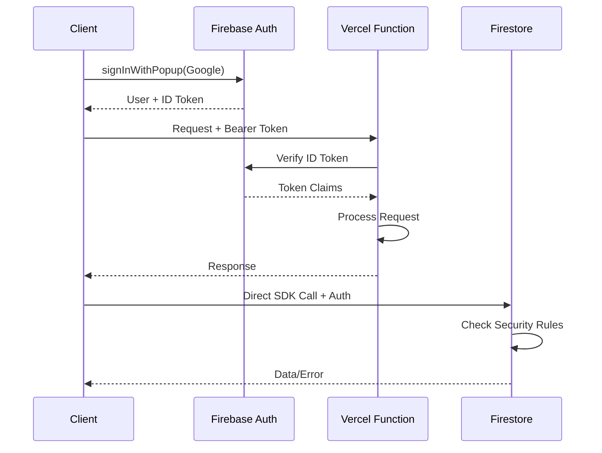

# Backend Architecture

## Service Architecture

Since this is primarily a frontend application with serverless functions, the backend is minimal:

### Serverless Architecture

#### Function Organization
```text
api/
├── generate-tests.ts       # AI test generation
├── health.ts              # Health check endpoint
└── _lib/
    ├── auth.ts           # Auth verification helpers
    ├── gemini.ts         # Gemini API wrapper
    └── errors.ts         # Error handling utilities
```

#### Function Template
```typescript
// api/generate-tests.ts
import type { VercelRequest, VercelResponse } from '@vercel/node';
import { GoogleGenerativeAI } from '@google/generative-ai';
import { verifyAuth } from './_lib/auth';
import { handleError } from './_lib/errors';

const genAI = new GoogleGenerativeAI(process.env.GEMINI_API_KEY!);

export default async function handler(
  req: VercelRequest,
  res: VercelResponse
) {
  // CORS headers
  res.setHeader('Access-Control-Allow-Origin', '*');
  res.setHeader('Access-Control-Allow-Methods', 'POST, OPTIONS');
  
  if (req.method === 'OPTIONS') {
    return res.status(200).end();
  }
  
  try {
    // Verify authentication (optional)
    const user = await verifyAuth(req.headers.authorization);
    
    const { code, sectionName, context } = req.body;
    
    // Generate prompt for AI
    const prompt = `Generate comprehensive test cases for this JavaScript function:
    
    Section: ${sectionName}
    Context: ${JSON.stringify(context)}
    Code:
    ${code}
    
    Return test cases that cover normal cases, edge cases, and error conditions.`;
    
    // Call Gemini API
    const model = genAI.getGenerativeModel({ model: 'gemini-pro' });
    const result = await model.generateContent(prompt);
    const response = await result.response;
    const testCases = parseTestCases(response.text());
    
    res.status(200).json({ testCases });
  } catch (error) {
    handleError(error, res);
  }
}

function parseTestCases(aiResponse: string): TestCase[] {
  // Parse AI response into structured test cases
  // Implementation details...
}
```

## Database Architecture

Since we're using Firebase Firestore (NoSQL), the database architecture focuses on document structure and access patterns:

### Schema Design
```sql
-- Conceptual representation (Firestore is NoSQL)
-- Collection: references
CREATE COLLECTION references (
  id STRING PRIMARY KEY,
  name STRING NOT NULL,
  userId STRING,
  sections ARRAY<Section>,
  populationType ENUM('adult', 'pediatric', 'neonatal'),
  healthSystem STRING,
  metadata MAP,
  createdAt TIMESTAMP,
  updatedAt TIMESTAMP,
  
  INDEX idx_user_updated (userId, updatedAt DESC),
  INDEX idx_population_name (populationType, name)
);

-- Embedded Section structure
TYPE Section = {
  id: STRING,
  type: ENUM('static', 'dynamic'),
  name: STRING,
  content: TEXT,
  order: INTEGER,
  isActive: BOOLEAN,
  testCases: ARRAY<TestCase>
};
```

### Data Access Layer
```typescript
// src/lib/services/firebaseDataService.ts
import { 
  collection, 
  doc, 
  setDoc, 
  getDoc, 
  query, 
  where, 
  orderBy 
} from 'firebase/firestore';
import { db } from '$lib/firebase';

export class FirebaseRepository {
  private readonly collectionName = 'references';
  
  async save(reference: Reference): Promise<void> {
    const docRef = doc(db, this.collectionName, reference.id);
    await setDoc(docRef, {
      ...reference,
      updatedAt: new Date()
    });
  }
  
  async findById(id: string): Promise<Reference | null> {
    const docRef = doc(db, this.collectionName, id);
    const docSnap = await getDoc(docRef);
    
    if (!docSnap.exists()) return null;
    return docSnap.data() as Reference;
  }
  
  async findByUser(userId: string): Promise<Reference[]> {
    const q = query(
      collection(db, this.collectionName),
      where('userId', '==', userId),
      orderBy('updatedAt', 'desc')
    );
    
    const snapshot = await getDocs(q);
    return snapshot.docs.map(doc => doc.data() as Reference);
  }
  
  async subscribeToReference(
    id: string, 
    callback: (ref: Reference) => void
  ): () => void {
    const docRef = doc(db, this.collectionName, id);
    return onSnapshot(docRef, (doc) => {
      if (doc.exists()) {
        callback(doc.data() as Reference);
      }
    });
  }
}

export const referenceRepository = new FirebaseRepository();
```

## Authentication and Authorization

### Auth Flow


### Middleware/Guards
```typescript
// api/_lib/auth.ts
import { auth } from 'firebase-admin';

export async function verifyAuth(
  authHeader?: string
): Promise<UserClaims | null> {
  if (!authHeader?.startsWith('Bearer ')) {
    return null; // Anonymous access allowed
  }
  
  const token = authHeader.split('Bearer ')[1];
  
  try {
    const decodedToken = await auth().verifyIdToken(token);
    return {
      uid: decodedToken.uid,
      email: decodedToken.email,
      role: decodedToken.role || 'user'
    };
  } catch (error) {
    console.error('Token verification failed:', error);
    return null;
  }
}

// Usage in API routes
export function requireAuth(
  handler: (req: Request, res: Response, user: UserClaims) => Promise<void>
) {
  return async (req: Request, res: Response) => {
    const user = await verifyAuth(req.headers.authorization);
    
    if (!user) {
      return res.status(401).json({ error: 'Unauthorized' });
    }
    
    return handler(req, res, user);
  };
}
```
