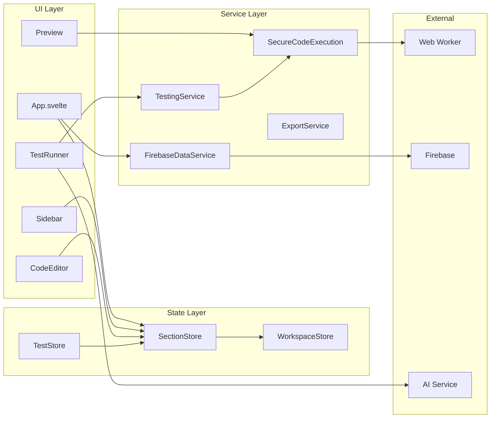

# Components

## Frontend Components

### App Component
**Responsibility:** Main application orchestrator and layout manager

**Key Interfaces:**
- Manages global application state
- Coordinates between all major UI components
- Handles Firebase authentication flow
- Manages save/load operations

**Dependencies:** All stores, Firebase services, all major components

**Technology Stack:** Svelte 5 with runes, TypeScript

### CodeEditor Component
**Responsibility:** Provides syntax-highlighted code editing for HTML and JavaScript

**Key Interfaces:**
- `value: string` - Current code content
- `language: 'html' | 'javascript'` - Syntax mode
- `onChange: (value: string) => void` - Change handler
- `error?: string` - Display syntax errors

**Dependencies:** CodeMirror 6, theme configuration

**Technology Stack:** Svelte 5 wrapper around CodeMirror 6

### Preview Component
**Responsibility:** Renders live preview of sections with sandboxed JavaScript execution

**Key Interfaces:**
- `sections: Section[]` - Sections to render
- `tpnContext: TPNContext` - Runtime context for dynamic sections
- `onError: (error: Error) => void` - Error handler

**Dependencies:** SecureCodeExecution service, DOMPurify

**Technology Stack:** Svelte 5, Web Worker for sandboxing

### TestRunner Component
**Responsibility:** Manages and executes test cases for dynamic sections

**Key Interfaces:**
- `section: Section` - Target section with tests
- `onTestComplete: (results: TestResult[]) => void` - Results callback
- `generateTests: () => Promise<TestCase[]>` - AI generation trigger

**Dependencies:** Testing service, Code execution service

**Technology Stack:** Svelte 5, async test execution

### Sidebar Component
**Responsibility:** Section management and navigation

**Key Interfaces:**
- `sections: Section[]` - List of all sections
- `activeSection: string` - Currently selected section
- `onSectionSelect: (id: string) => void` - Selection handler
- `onSectionCreate/Delete/Reorder` - CRUD operations

**Dependencies:** Section store, drag-and-drop utilities

**Technology Stack:** Svelte 5, Skeleton UI styling

## Backend Services

### SecureCodeExecution Service
**Responsibility:** Sandboxed JavaScript execution with TPN context injection

**Key Interfaces:**
- `execute(code: string, context: TPNContext): Promise<ExecutionResult>`
- `validate(code: string): ValidationResult`
- `transpile(code: string): string`

**Dependencies:** Web Worker, Babel CDN

**Technology Stack:** TypeScript, Web Worker API, Babel Standalone

### FirebaseDataService
**Responsibility:** All Firebase operations for authentication and data persistence

**Key Interfaces:**
- `saveReference(ref: Reference): Promise<void>`
- `loadReference(id: string): Promise<Reference>`
- `listReferences(): Promise<Reference[]>`
- `authenticate(): Promise<User>`
- `subscribeToChanges(callback): Unsubscribe`

**Dependencies:** Firebase SDK (Auth, Firestore)

**Technology Stack:** TypeScript, Firebase SDK v12

### ExportService
**Responsibility:** Convert internal format to required JSON output format

**Key Interfaces:**
- `exportToJSON(sections: Section[]): string`
- `importFromJSON(json: string): Section[]`
- `validateFormat(json: string): boolean`

**Dependencies:** Section model definitions

**Technology Stack:** TypeScript, JSON processing

### TestingService
**Responsibility:** Test case execution and validation

**Key Interfaces:**
- `runTest(testCase: TestCase, code: string): TestResult`
- `runAllTests(section: Section): TestResult[]`
- `compareOutput(expected: string, actual: string): boolean`

**Dependencies:** SecureCodeExecution service

**Technology Stack:** TypeScript, async execution

### AITestGenerationService (Serverless)
**Responsibility:** Generate test cases using Google Gemini AI

**Key Interfaces:**
- `POST /api/generate-tests` - HTTP endpoint
- `generateTestCases(code: string, context: any): Promise<TestCase[]>`

**Dependencies:** Google Gemini API

**Technology Stack:** TypeScript, Vercel Functions, Gemini SDK

## Component Interaction Diagram

