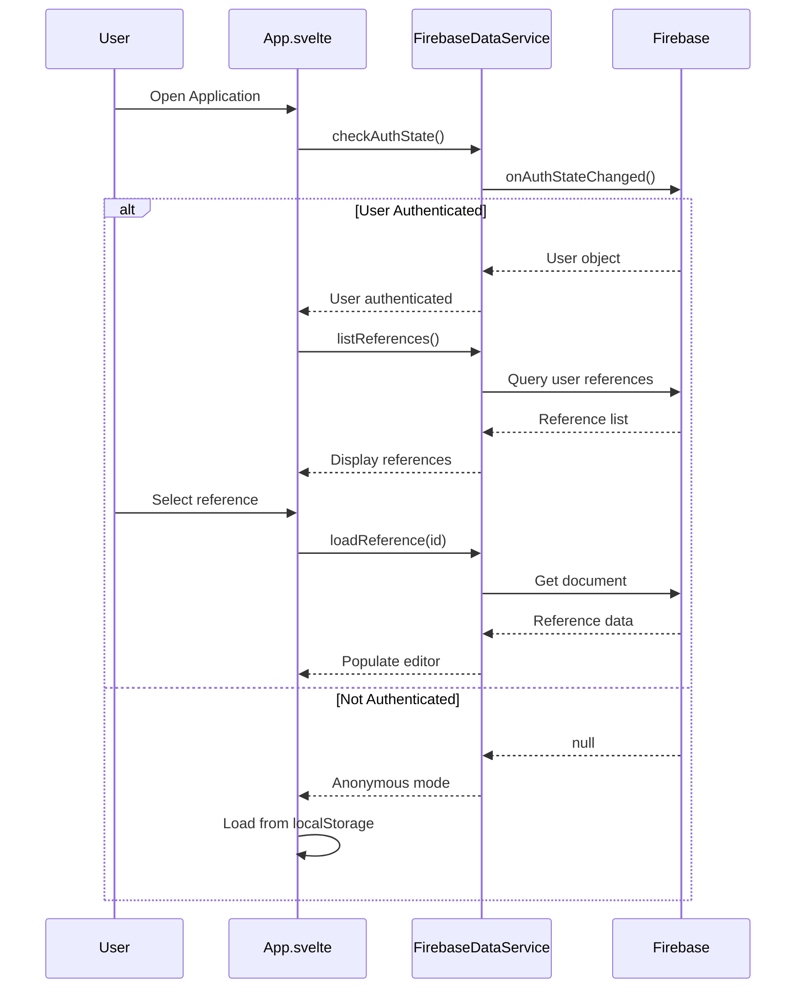
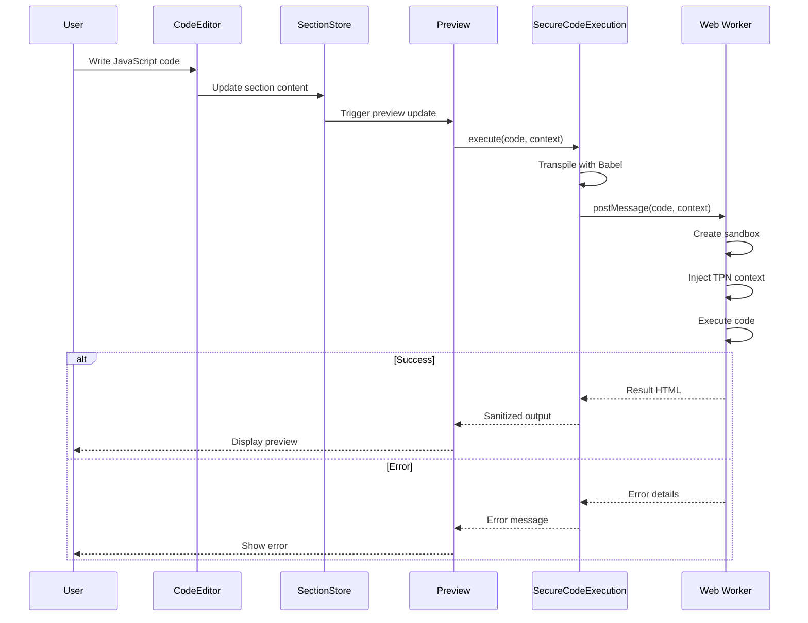
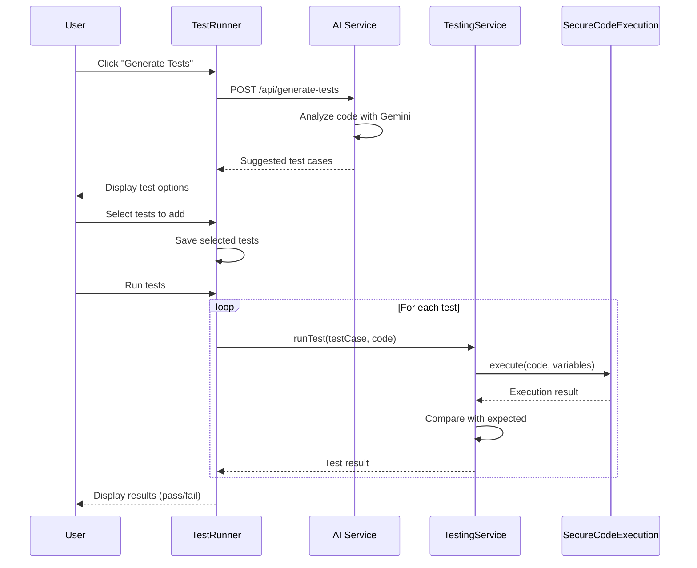

# Core Workflows

## User Authentication and Load Workflow

```mermaid
sequenceDiagram
    participant U as User
    participant UI as App.svelte
    participant FDS as FirebaseDataService
    participant FB as Firebase
    
    U->>UI: Open Application
    UI->>FDS: checkAuthState()
    FDS->>FB: onAuthStateChanged()
    
    alt User Authenticated
        FB-->>FDS: User object
        FDS-->>UI: User authenticated
        UI->>FDS: listReferences()
        FDS->>FB: Query user references
        FB-->>FDS: Reference list
        FDS-->>UI: Display references
        U->>UI: Select reference
        UI->>FDS: loadReference(id)
        FDS->>FB: Get document
        FB-->>FDS: Reference data
        FDS-->>UI: Populate editor
    else Not Authenticated
        FB-->>FDS: null
        FDS-->>UI: Anonymous mode
        UI->>UI: Load from localStorage
    end
```

## Dynamic Code Execution Workflow

```mermaid
sequenceDiagram
    participant U as User
    participant CE as CodeEditor
    participant SS as SectionStore
    participant PR as Preview
    participant SCE as SecureCodeExecution
    participant WW as Web Worker
    
    U->>CE: Write JavaScript code
    CE->>SS: Update section content
    SS->>PR: Trigger preview update
    PR->>SCE: execute(code, context)
    SCE->>SCE: Transpile with Babel
    SCE->>WW: postMessage(code, context)
    
    WW->>WW: Create sandbox
    WW->>WW: Inject TPN context
    WW->>WW: Execute code
    
    alt Success
        WW-->>SCE: Result HTML
        SCE-->>PR: Sanitized output
        PR-->>U: Display preview
    else Error
        WW-->>SCE: Error details
        SCE-->>PR: Error message
        PR-->>U: Show error
    end
```

## Test Generation and Execution Workflow

```mermaid
sequenceDiagram
    participant U as User
    participant TR as TestRunner
    participant AI as AI Service
    participant TSV as TestingService
    participant SCE as SecureCodeExecution
    
    U->>TR: Click "Generate Tests"
    TR->>AI: POST /api/generate-tests
    AI->>AI: Analyze code with Gemini
    AI-->>TR: Suggested test cases
    TR-->>U: Display test options
    U->>TR: Select tests to add
    TR->>TR: Save selected tests
    
    U->>TR: Run tests
    loop For each test
        TR->>TSV: runTest(testCase, code)
        TSV->>SCE: execute(code, variables)
        SCE-->>TSV: Execution result
        TSV->>TSV: Compare with expected
        TSV-->>TR: Test result
    end
    TR-->>U: Display results (pass/fail)
```
