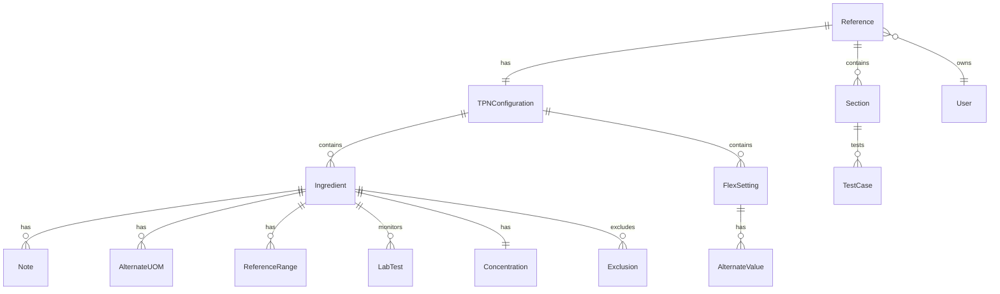

# Data Models

## Core Data Models

### TPN Configuration Model
**Purpose:** Represents a complete TPN configuration with ingredients and flexible settings

**Key Attributes:**
- `INGREDIENT`: Ingredient[] - Array of ingredient definitions
- `FLEX`: FlexSetting[] - Array of flexible configuration settings

**TypeScript Interface:**
```typescript
interface TPNConfiguration {
  INGREDIENT: Ingredient[];
  FLEX: FlexSetting[];
}
```

**Relationships:**
- Has many Ingredients (1:N)
- Has many FlexSettings (1:N)

### Ingredient Model
**Purpose:** Defines a single TPN ingredient with all its properties and constraints

**Key Attributes:**
- `KEYNAME`: string - Unique identifier for the ingredient
- `DISPLAY`: string - Display name shown to users
- `MNEMONIC`: string - Medical mnemonic/description
- `UOM_DISP`: string - Unit of measure display (e.g., "mL/kg/day", "gm/kg/day")
- `TYPE`: IngredientType - Category of ingredient
- `EDITMODE`: string - Edit mode ("None", "Custom", etc.)
- `PRECISION`: number - Decimal places for display
- `OSMO_RATIO`: number - Osmolarity ratio
- `NOTE`: Note[] - Array of text notes (can include dynamic JavaScript)
- `ALTUOM`: AlternateUOM[] - Alternative units of measure
- `REFERENCE_RANGE`: ReferenceRange[] - Threshold values
- `LABS`: LabTest[] - Associated laboratory tests
- `CONCENTRATION`: Concentration - Strength and volume information
- `EXCLUDES`: Exclusion[] - Mutually exclusive ingredients

**TypeScript Interface:**
```typescript
interface Ingredient {
  KEYNAME: string;
  DISPLAY: string;
  MNEMONIC: string;
  UOM_DISP: string;
  TYPE: 'Macronutrient' | 'Micronutrient' | 'Additive' | 'Salt' | 'Diluent' | 'Other';
  EDITMODE?: 'None' | 'Custom';
  PRECISION: number;
  SPECIAL?: string;
  OSMO_RATIO: number;
  NOTE: Note[];
  ALTUOM: AlternateUOM[];
  REFERENCE_RANGE: ReferenceRange[];
  LABS: LabTest[];
  CONCENTRATION: Concentration;
  EXCLUDES: Exclusion[];
}
```

**Relationships:**
- Has many Notes (1:N)
- Has many AlternateUOMs (1:N)
- Has many ReferenceRanges (1:N)
- Has many LabTests (1:N)
- Has one Concentration (1:1)
- Has many Exclusions (1:N)

### Note Model
**Purpose:** Contains text content or dynamic JavaScript for ingredient documentation

**Key Attributes:**
- `TEXT`: string - Static text or dynamic JavaScript code wrapped in `[f( ... )]`

**TypeScript Interface:**
```typescript
interface Note {
  TEXT: string;
}
```

**Special Format:**
- Dynamic content is wrapped in `[f( ... )]` markers
- Can access TPN context via `me` object (e.g., `me.getValue('DoseWeightKG')`)
- Supports JavaScript expressions for calculations

### AlternateUOM Model
**Purpose:** Defines alternative units of measure for an ingredient

**Key Attributes:**
- `NAME`: string - Name of the alternative unit
- `UOM_DISP`: string - Display string for the unit

**TypeScript Interface:**
```typescript
interface AlternateUOM {
  NAME: string;
  UOM_DISP: string;
}
```

### ReferenceRange Model
**Purpose:** Defines threshold values for ingredient dosing

**Key Attributes:**
- `THRESHOLD`: ThresholdType - Type of threshold
- `VALUE`: number - Threshold value

**TypeScript Interface:**
```typescript
interface ReferenceRange {
  THRESHOLD: 'Feasible Low' | 'Critical Low' | 'Normal Low' | 
             'Normal High' | 'Critical High' | 'Feasible High';
  VALUE: number;
}
```

### LabTest Model
**Purpose:** Associates laboratory tests with ingredients for monitoring

**Key Attributes:**
- `DISPLAY`: string - Display name of the test
- `EVENT_SET_NAME`: string - Event set identifier in the medical system
- `GRAPH`: number - Whether to graph results (0 or 1)

**TypeScript Interface:**
```typescript
interface LabTest {
  DISPLAY: string;
  EVENT_SET_NAME: string;
  GRAPH: 0 | 1;
}
```

### Concentration Model
**Purpose:** Defines concentration and volume information for ingredients

**Key Attributes:**
- `STRENGTH`: number - Concentration strength
- `STRENGTH_UOM`: string - Unit for strength
- `VOLUME`: number - Volume amount
- `VOLUME_UOM`: string - Unit for volume

**TypeScript Interface:**
```typescript
interface Concentration {
  STRENGTH: number;
  STRENGTH_UOM: string;
  VOLUME: number;
  VOLUME_UOM: string;
}
```

### Exclusion Model
**Purpose:** Defines mutually exclusive ingredients

**Key Attributes:**
- `keyname`: string - KEYNAME of the excluded ingredient

**TypeScript Interface:**
```typescript
interface Exclusion {
  keyname: string;
}
```

### FlexSetting Model
**Purpose:** Flexible configuration settings that can vary by facility or context

**Key Attributes:**
- `NAME`: string - Setting identifier
- `VALUE`: string - Default value
- `CONFIG_COMMENT`: string - Optional comment explaining the setting
- `ALT_VALUE`: AlternateValue[] - Conditional overrides

**TypeScript Interface:**
```typescript
interface FlexSetting {
  NAME: string;
  VALUE: string;
  CONFIG_COMMENT?: string;
  ALT_VALUE: AlternateValue[];
}
```

### AlternateValue Model
**Purpose:** Conditional override for flex settings based on context

**Key Attributes:**
- `CHECKTYPE`: string - Type of check (e.g., "Facility")
- `CHECKMATCH`: string - Value to match against
- `OVERRIDE_VALUE`: string - Value to use when condition matches

**TypeScript Interface:**
```typescript
interface AlternateValue {
  CHECKTYPE: string;
  CHECKMATCH: string;
  OVERRIDE_VALUE: string;
}
```

### Section Model (Existing - Updated)
**Purpose:** Represents a content block that can be either static HTML or dynamic JavaScript

**Key Attributes:**
- `id`: string - Unique identifier (UUID)
- `type`: 'static' | 'dynamic' - Content type
- `name`: string - Display name for the section
- `content`: string - HTML or JavaScript code
- `order`: number - Position in the document
- `testCases`: TestCase[] - Associated tests (dynamic only)
- `isActive`: boolean - Whether section is enabled

**TypeScript Interface:**
```typescript
interface Section {
  id: string;
  type: 'static' | 'dynamic';
  name: string;
  content: string;
  order: number;
  testCases?: TestCase[];
  isActive: boolean;
}
```

**Relationships:**
- Has many TestCases (1:N)
- Belongs to Reference (N:1)

### TestCase Model (Existing)
**Purpose:** Defines test scenarios for dynamic JavaScript sections

**Key Attributes:**
- `id`: string - Unique identifier
- `name`: string - Test case name
- `variables`: Record<string, any> - Input values for test
- `expectedOutput`: string - Expected result
- `expectedStyles`: string - Expected CSS styles
- `result`: 'pass' | 'fail' | 'pending' - Test execution status

**TypeScript Interface:**
```typescript
interface TestCase {
  id: string;
  name: string;
  variables: Record<string, any>;
  expectedOutput: string;
  expectedStyles?: string;
  result?: 'pass' | 'fail' | 'pending';
  actualOutput?: string;
  error?: string;
}
```

**Relationships:**
- Belongs to Section (N:1)

### Reference Model (Updated)
**Purpose:** Top-level configuration document for an ingredient

**Key Attributes:**
- `id`: string - Unique identifier
- `name`: string - Configuration name
- `sections`: Section[] - Ordered list of sections
- `configuration`: TPNConfiguration - Full TPN configuration data
- `populationType`: string - Patient population type
- `healthSystem`: string - Healthcare system identifier
- `metadata`: object - Additional configuration data
- `createdAt`: timestamp - Creation date
- `updatedAt`: timestamp - Last modification date
- `userId`: string - Owner's Firebase UID

**TypeScript Interface:**
```typescript
interface Reference {
  id: string;
  name: string;
  sections: Section[];
  configuration: TPNConfiguration;
  populationType: 'adult' | 'pediatric' | 'neonatal';
  healthSystem: string;
  metadata?: {
    version?: string;
    tags?: string[];
    description?: string;
  };
  createdAt: Date;
  updatedAt: Date;
  userId?: string;
}
```

**Relationships:**
- Has many Sections (1:N)
- Has one TPNConfiguration (1:1)
- Belongs to User (N:1)

### TPNContext Model (Updated)
**Purpose:** Provides runtime context for dynamic JavaScript execution

**Key Attributes:**
- `getValue`: (key: string) => any - Access TPN calculation values
- `ingredients`: Ingredient[] - Available ingredients from configuration
- `populationType`: string - Current population context
- `healthSystem`: string - Current health system
- `maxP`: (value: number, precision: number) => string - Precision formatting helper

**TypeScript Interface:**
```typescript
interface TPNContext {
  getValue: (key: string) => any;
  ingredients: Ingredient[];
  populationType: 'adult' | 'pediatric' | 'neonatal';
  healthSystem: string;
  maxP: (value: number, precision: number) => string;
  // Additional helper methods available in runtime
}
```

**Relationships:**
- Injected into dynamic section execution
- Read-only access from sandboxed code
- Provides access to ingredient configuration data

## Data Model Relationships



## Dynamic Content Execution

The system supports dynamic JavaScript content within Note fields using the `[f( ... )]` syntax:

```javascript
// Example from TPNVolume ingredient
[f( 
  var rv=''; 
  var WT=parseFloat(me.getValue('DoseWeightKG'));
  if( WT === 0 ){ 
    rv='Enter a weight'; 
  } else if( WT<10 ){  
    rv+='<u>Holliday-Segar Maintenance Fluid Calculation</u>\n';
    rv+='under 10kg: 100 mL/kg/day'; 
  }
  // ... more logic
  return rv; 
)]
```

This dynamic content:
- Has access to the `me` context object
- Can read ingredient values via `me.getValue(keyname)`
- Can perform calculations based on patient data
- Returns HTML-formatted text for display
- Is executed in the secure sandboxed environment

## Schema Validation

The system uses the JSON schema defined in `refs/schema.json` to validate configuration files. This ensures:
- All required fields are present
- Data types match expectations
- Enum values are valid
- UI hints are properly structured
- Relationships maintain referential integrity