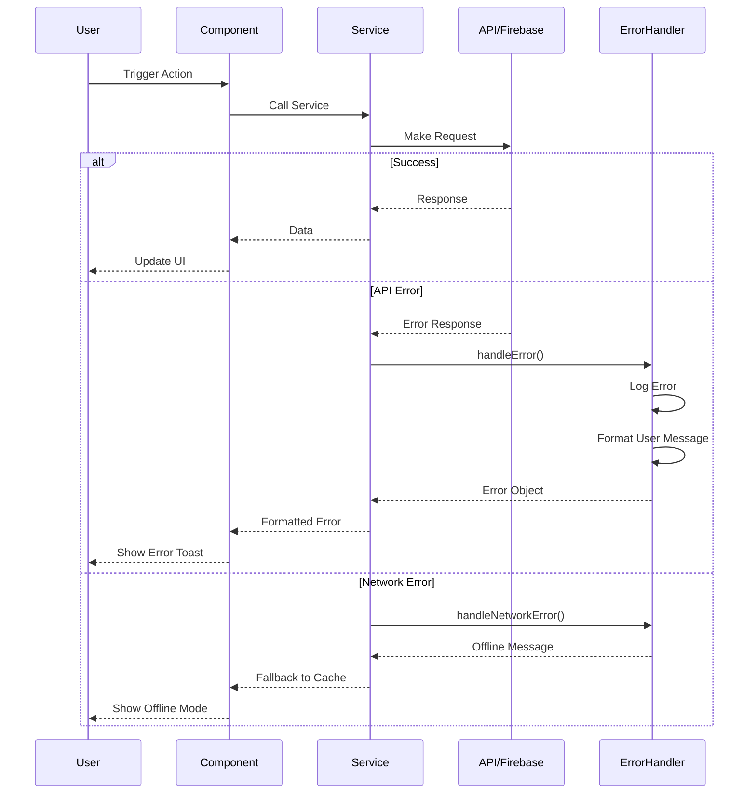

# Error Handling Strategy

## Error Flow



## Error Response Format

```typescript
interface ApiError {
  error: {
    code: string;
    message: string;
    details?: Record<string, any>;
    timestamp: string;
    requestId: string;
  };
}
```

## Frontend Error Handling

```typescript
// src/lib/services/errorHandler.ts
export class ErrorHandler {
  static handle(error: unknown): UserError {
    console.error('Error occurred:', error);
    
    if (error instanceof FirebaseError) {
      return this.handleFirebaseError(error);
    }
    
    if (error instanceof NetworkError) {
      return this.handleNetworkError(error);
    }
    
    if (error instanceof ValidationError) {
      return this.handleValidationError(error);
    }
    
    // Default error
    return {
      message: 'An unexpected error occurred. Please try again.',
      code: 'UNKNOWN_ERROR',
      retry: true
    };
  }
  
  private static handleFirebaseError(error: FirebaseError): UserError {
    const errorMap: Record<string, string> = {
      'permission-denied': 'You don\'t have permission to perform this action.',
      'not-found': 'The requested data could not be found.',
      'already-exists': 'This item already exists.',
      'resource-exhausted': 'Too many requests. Please try again later.'
    };
    
    return {
      message: errorMap[error.code] || 'Database operation failed.',
      code: error.code,
      retry: error.code !== 'permission-denied'
    };
  }
}
```

## Backend Error Handling

```typescript
// api/_lib/errors.ts
export function handleError(error: unknown, res: VercelResponse) {
  const requestId = crypto.randomUUID();
  const timestamp = new Date().toISOString();
  
  console.error(`[${requestId}] Error:`, error);
  
  if (error instanceof ValidationError) {
    return res.status(400).json({
      error: {
        code: 'VALIDATION_ERROR',
        message: error.message,
        details: error.details,
        timestamp,
        requestId
      }
    });
  }
  
  if (error instanceof AuthError) {
    return res.status(401).json({
      error: {
        code: 'AUTH_ERROR',
        message: 'Authentication required',
        timestamp,
        requestId
      }
    });
  }
  
  // Default 500 error
  return res.status(500).json({
    error: {
      code: 'INTERNAL_ERROR',
      message: 'An internal error occurred',
      timestamp,
      requestId
    }
  });
}
```
