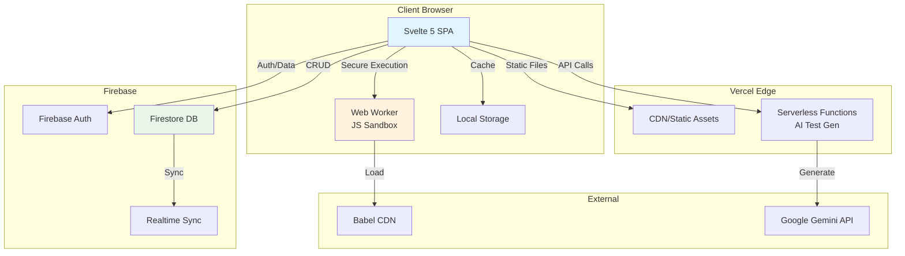

# High Level Architecture

## Technical Summary

The TPN Dynamic Text Editor is a specialized single-page application built with Svelte 5 and deployed as a static site with serverless functions. It uses a component-based frontend architecture with Web Worker sandboxing for secure JavaScript execution. The backend leverages Firebase for real-time data persistence and authentication, with Vercel Functions providing AI-powered test generation. The system achieves PRD goals through real-time reactivity via Svelte stores, secure code execution in isolated workers, and a dual-mode editor supporting both static HTML and dynamic JavaScript content with live preview capabilities.

## Platform and Infrastructure Choice

**Platform:** Vercel + Firebase
**Key Services:** Vercel (hosting, serverless functions), Firebase (Firestore, Auth), CDN (Babel standalone)
**Deployment Host and Regions:** Vercel Edge Network (global), Firebase multi-region (us-central1 primary)

## Repository Structure

**Structure:** Monorepo (single package)
**Monorepo Tool:** pnpm workspaces (native)
**Package Organization:** Single package with modular service/component architecture

## High Level Architecture Diagram

## Architectural Patterns

- **Component-Based Architecture:** Svelte 5 components with runes for reactivity - _Rationale:_ Enables modular development and easier testing of individual features
- **Web Worker Sandboxing:** Isolated JavaScript execution environment - _Rationale:_ Prevents user code from accessing main application context, ensuring security
- **Store-Based State Management:** Centralized Svelte stores with $state runes - _Rationale:_ Provides predictable state updates and enables reactive UI updates
- **Serverless Functions:** Stateless API endpoints for AI operations - _Rationale:_ Scales automatically and reduces infrastructure overhead
- **Event-Driven Updates:** Reactive effects trigger on state changes - _Rationale:_ Ensures UI stays synchronized with data model
- **Progressive Enhancement:** Core functionality works offline, enhanced features require connection - _Rationale:_ Provides resilient user experience
- **Repository Pattern:** Service layer abstracts data operations - _Rationale:_ Decouples UI from data persistence logic
