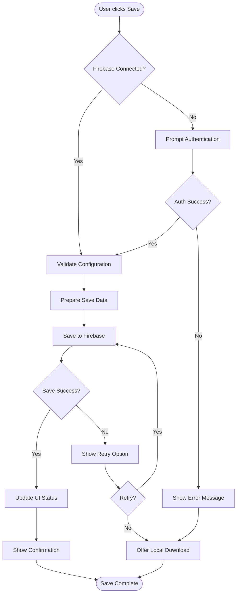
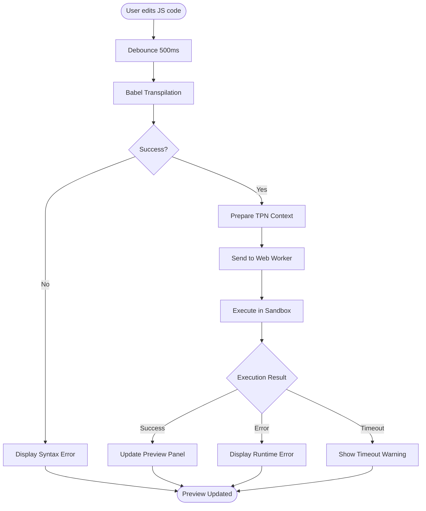
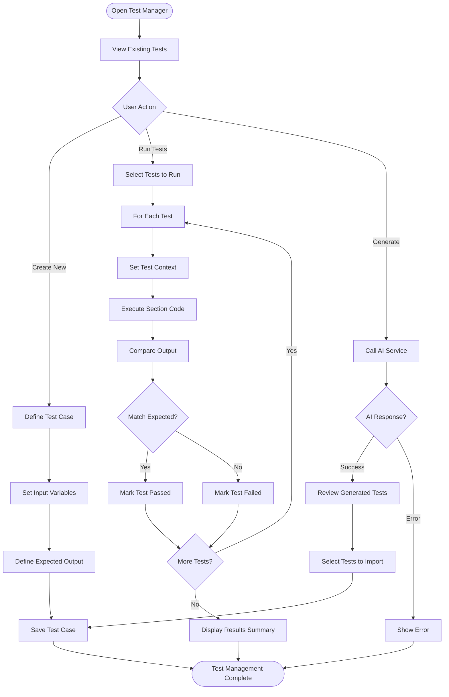

# TPN Dynamic Text Editor UI/UX Specification

This document defines the user experience goals, information architecture, user flows, and visual design specifications for TPN Dynamic Text Editor's user interface. It serves as the foundation for visual design and frontend development, ensuring a cohesive and user-centered experience.

## Overall UX Goals & Principles

### Target User Personas

**1. Medical Content Creators**
- Healthcare professionals who need to create dynamic medical reference texts
- Require accurate TPN calculations and reliable data handling
- Value efficiency and error prevention in medical content creation

**2. Technical Administrators**
- System managers who configure and maintain TPN references
- Need robust testing capabilities and version control
- Value data integrity and system reliability

**3. Clinical End Users**
- Healthcare providers who consume the generated reference content
- Need clear, accurate, and accessible medical information
- Value fast loading times and mobile accessibility

### Usability Goals

1. **Immediate Productivity:** Users can start creating content within 2 minutes
2. **Error Prevention:** Clear validation and safeguards for medical data
3. **Real-time Feedback:** Live preview updates as users type (currently broken, needs restoration)
4. **Mobile Accessibility:** Full functionality on tablets and phones for clinical settings
5. **Offline Capability:** Work continues even without internet connection

### Design Principles

1. **Medical Accuracy First** - Never compromise on data integrity or calculation precision
2. **Progressive Complexity** - Simple for basic tasks, powerful tools available when needed
3. **Transparent State** - Always show save status, sync state, and calculation results
4. **Fail Gracefully** - Clear error messages and recovery paths for all failure modes
5. **Accessible by Design** - WCAG AA compliance for healthcare environments

### Change Log

| Date | Version | Description | Author |
|------|---------|-------------|--------|
| 2025-01-30 | 1.0 | Initial UI/UX specification | Sally (UX Expert) |

## Information Architecture (IA)

### Site Map / Screen Inventory

```mermaid
graph TD
    A[App Root] --> B[Main Editor View]
    A --> C[Firebase Management]
    A --> D[Settings & Config]
    
    B --> B1[Sidebar]
    B --> B2[Code Editor Panel]
    B --> B3[Preview Panel]
    B --> B4[TPN Test Panel]
    
    B1 --> B1a[Section List]
    B1 --> B1b[Add Section Controls]
    B1 --> B1c[Reorder Sections]
    B1 --> B1d[Import/Export Tools]
    
    B2 --> B2a[Static HTML Editor]
    B2 --> B2b[Dynamic JS Editor]
    B2 --> B2c[Editor Toolbar]
    B2 --> B2d[Test Case Manager]
    
    B3 --> B3a[Live Preview]
    B3 --> B3b[Error Display]
    B3 --> B3c[Copy Output]
    B3 --> B3d[Export Options]
    
    B4 --> B4a[Population Selector]
    B4 --> B4b[Value Inputs]
    B4 --> B4c[Test Runner]
    B4 --> B4d[AI Test Generator]
    
    C --> C1[Save Configuration]
    C --> C2[Load Configuration]
    C --> C3[Version History]
    C --> C4[Diff Tool]
    
    D --> D1[TPN Settings]
    D --> D2[Editor Preferences]
    D --> D3[Firebase Config]
    D --> D4[Export Settings]
```

### Navigation Structure

**Primary Navigation:**
- **Workspace Selector** - Top bar dropdown for switching between saved configurations
- **Main Action Bar** - Save, Load, Import, Export, Settings buttons
- **Mode Toggle** - Switch between Edit and Preview modes

**Secondary Navigation:**
- **Section Navigation** - Sidebar list with direct jump to any section
- **Tab Navigation** - Within editor panel for switching between code/tests/settings
- **Tool Panels** - Collapsible panels for TPN testing, Firebase management

**Breadcrumb Strategy:**
- Show current configuration name > Current section name > Current view (Edit/Test/Preview)
- Example: "Emergency Protocol v2 > Electrolyte Management > Edit Mode"

## User Flows

### Flow 1: Save and Load Configuration (P0 - Story 1)

**User Goal:** Save current work to Firebase and retrieve it later without data loss

**Entry Points:** 
- Save button in main toolbar
- Keyboard shortcut (Ctrl+S)
- Auto-save prompt when closing

**Success Criteria:** Configuration saved with confirmation, retrievable with perfect state restoration

**Edge Cases & Error Handling:**
- Network failure during save → Offer local download fallback
- Invalid Firebase credentials → Clear error message with re-auth option
- Concurrent edit conflicts → Show diff and merge options
- Large file size → Show progress indicator during save
- Corrupted data → Validate before save, prevent data loss

**Notes:** Must preserve all state including section order, test cases, and TPN context

### Flow 2: Execute Dynamic JavaScript Section (P0 - Story 2)

**User Goal:** Write and execute JavaScript code with TPN context access

**Entry Points:**
- Select "Dynamic" mode when creating section
- Switch existing section to dynamic mode
- Edit code in dynamic section

**Success Criteria:** Code executes securely with proper context and shows results/errors

**Edge Cases & Error Handling:**
- Infinite loops → 5-second timeout protection
- Invalid TPN context access → Clear error message
- Memory exhaustion → Limit worker memory
- Malicious code attempts → Sandbox prevents system access
- Syntax errors → Show line numbers and error details

**Notes:** The `me` object must be fully populated with TPN values before execution

### Flow 3: Manage Test Cases (P1 - Story 4)

**User Goal:** Create and run test cases for dynamic sections

**Entry Points:**
- "Tests" tab in dynamic section editor
- "Generate Tests" button for AI assistance
- Test panel in sidebar

**Success Criteria:** Tests created, executed, and results clearly shown

**Edge Cases & Error Handling:**
- Test execution timeout → Mark as failed with timeout reason
- Invalid test data → Validation before save
- AI service unavailable → Graceful degradation
- Circular dependencies → Detect and warn
- Test conflicts → Show which values differ

**Notes:** Test results must be persisted with the configuration

## Wireframes & Mockups

**Primary Design Files:** To be created in Figma (recommended) or browser-based tools like Excalidraw

### Key Screen Layouts

#### 1. Main Editor View

**Purpose:** Primary workspace for creating and editing dynamic medical text content

**Key Elements:**
- **Left Sidebar (300px):** Section list with drag-to-reorder, add/delete buttons, section type indicators
- **Center Editor Panel (flex-grow):** CodeMirror editor with syntax highlighting, mode toggle (HTML/JS), toolbar with formatting options
- **Right Preview Panel (400px):** Live rendered output, error display area, copy/export buttons
- **Bottom TPN Test Panel (collapsible, 200px):** Population selector, value inputs grid, test execution controls

**Interaction Notes:** 
- Panels resizable via drag handles
- Sidebar and preview can be collapsed for full-screen editing
- Keyboard shortcuts for all major actions (save, preview, test)

**Design File Reference:** `figma://main-editor-layout`

#### 2. Firebase Management Modal

**Purpose:** Handle save/load operations with clear feedback

**Key Elements:**
- **Modal Header:** Title "Firebase Configuration" with close button
- **Configuration List:** Saved configs with timestamps, size, last-modified info
- **Action Buttons:** Save Current, Load Selected, Delete, Create New
- **Status Indicator:** Connection status, last sync time, error messages

**Interaction Notes:**
- Modal overlay with backdrop
- Escape key to close
- Confirmation dialogs for destructive actions

**Design File Reference:** `figma://firebase-modal`

#### 3. Test Case Manager

**Purpose:** Create, edit, and run test cases for dynamic sections

**Key Elements:**
- **Test List:** Collapsible test cases with pass/fail indicators
- **Test Editor:** Input variables form, expected output field, test description
- **Execution Panel:** Run button, progress indicator, results display
- **AI Generator:** "Generate Tests" button with configuration options

**Interaction Notes:**
- Inline editing of test cases
- Batch selection for running multiple tests
- Keyboard navigation through test list

**Design File Reference:** `figma://test-manager`

#### 4. Mobile/Tablet Layout

**Purpose:** Responsive design for clinical point-of-care usage

**Key Elements:**
- **Stacked Layout:** Editor and preview as tabs instead of side-by-side
- **Hamburger Menu:** Collapsed sidebar accessible via menu
- **Floating Action Button:** Quick access to save/preview
- **Simplified Toolbar:** Essential actions only, rest in overflow menu

**Interaction Notes:**
- Swipe gestures to switch between editor/preview
- Touch-optimized button sizes (minimum 44px)
- Auto-hide keyboard when switching to preview

**Design File Reference:** `figma://mobile-responsive`

## Component Library / Design System

**Design System Approach:** Hybrid approach using Skeleton UI v3 CSS utilities as foundation, with custom Svelte 5 components for complex interactions. This leverages existing Skeleton patterns while allowing domain-specific customization for medical UI requirements.

### Core Components

#### 1. SectionCard

**Purpose:** Container for each content section in the sidebar and editor

**Variants:** Static (HTML content), Dynamic (JavaScript content), Collapsed/Expanded states, Error/Warning/Success states

**States:** Default, Hover, Active, Disabled, Loading, Error

**Usage Guidelines:** Use for all section representations. Include type indicator icon, title, action buttons. Maintain consistent padding and border radius. Support drag-and-drop reordering.

#### 2. CodeEditor

**Purpose:** Syntax-highlighted code input for HTML and JavaScript

**Variants:** HTML mode (with tag highlighting), JavaScript mode (with TPN context autocomplete), Read-only mode for viewing, Split view with line numbers

**States:** Default, Focused, Error (syntax issues), Warning (validation), Success (tests passing)

**Usage Guidelines:** Always include line numbers for error reporting. Provide clear mode indicator. Support theme switching (light/dark). Include toolbar for common actions.

#### 3. TestCaseCard

**Purpose:** Display and manage individual test cases

**Variants:** Compact (list view), Expanded (edit view), Running (with progress), Result (pass/fail/error)

**States:** Default, Running, Passed, Failed, Error, Disabled

**Usage Guidelines:** Show clear pass/fail indicators using colors and icons. Include execution time. Support inline editing. Group related tests visually.

#### 4. ValueInput

**Purpose:** Input fields for TPN values with validation

**Variants:** Number input (with units), Select dropdown (for populations), Text input (for string values), Checkbox (for boolean flags)

**States:** Default, Focused, Valid, Invalid, Disabled, Loading

**Usage Guidelines:** Always show units for medical values. Provide inline validation. Include help tooltips for complex fields. Support keyboard navigation.

#### 5. StatusIndicator

**Purpose:** Show connection, sync, and operation status

**Variants:** Firebase connection (connected/disconnected/syncing), Save status (saved/modified/saving/error), Test status (running/passed/failed), Preview status (rendering/ready/error)

**States:** Success, Warning, Error, Loading, Idle

**Usage Guidelines:** Use consistent colors across all indicators. Include timestamp for last action. Provide clear text labels, not just icons. Support color-blind friendly patterns.

#### 6. ActionButton

**Purpose:** Primary interactive elements for user actions

**Variants:** Primary (Save, Run Tests), Secondary (Cancel, Clear), Danger (Delete, Reset), Icon-only (toolbar actions), Floating (mobile FAB)

**States:** Default, Hover, Active, Loading, Disabled

**Usage Guidelines:** Maintain minimum 44px touch targets. Show loading states for async operations. Include keyboard shortcuts in tooltips. Use clear, action-oriented labels.

#### 7. Modal

**Purpose:** Overlay dialogs for focused tasks

**Variants:** Standard (Firebase management), Confirmation (delete actions), Full-screen (mobile), Side-panel (settings)

**States:** Opening, Open, Closing, Closed

**Usage Guidelines:** Always include close button and ESC handling. Trap focus within modal. Provide clear backdrop. Animate entrance/exit for context.

#### 8. ErrorBoundary

**Purpose:** Gracefully handle and display errors

**Variants:** Inline (within sections), Toast (temporary notifications), Full-page (critical errors), Collapsible (detailed stack traces)

**States:** Error, Warning, Info, Success

**Usage Guidelines:** Provide actionable error messages. Include recovery options. Log errors for debugging. Never show raw stack traces to end users.

## Branding & Style Guide

### Visual Identity

**Brand Guidelines:** Medical professional aesthetic with focus on clarity, trust, and precision. Clean, modern interface that prioritizes readability and reduces cognitive load in clinical settings.

### Color Palette

| Color Type | Hex Code | Usage |
|------------|----------|--------|
| Primary | #0EA5E9 | Primary actions, active states, links |
| Secondary | #8B5CF6 | Secondary actions, TPN-specific elements |
| Accent | #10B981 | Success states, valid inputs, passed tests |
| Success | #22C55E | Positive feedback, confirmations, saved states |
| Warning | #F59E0B | Cautions, validation warnings, unsaved changes |
| Error | #EF4444 | Errors, failed tests, invalid inputs |
| Neutral | #64748B, #94A3B8, #CBD5E1 | Text, borders, backgrounds (light to dark) |

### Typography

#### Font Families
- **Primary:** Inter, system-ui, -apple-system, sans-serif
- **Secondary:** Inter, system-ui (same family, different weights)
- **Monospace:** 'Fira Code', 'Cascadia Code', 'Monaco', monospace

#### Type Scale

| Element | Size | Weight | Line Height |
|---------|------|--------|-------------|
| H1 | 32px | 700 | 1.2 |
| H2 | 24px | 600 | 1.3 |
| H3 | 20px | 600 | 1.4 |
| Body | 16px | 400 | 1.5 |
| Small | 14px | 400 | 1.4 |

### Iconography

**Icon Library:** Lucide Icons (open source, medical icons available)

**Usage Guidelines:** 
- Use consistent 20px size for toolbar icons
- 16px for inline/small icons
- 24px for primary action buttons
- Always pair icons with text labels for accessibility
- Use outline style for consistency

### Spacing & Layout

**Grid System:** 12-column responsive grid with 16px gutters

**Spacing Scale:** 
- Base unit: 4px
- Scale: 0, 4px, 8px, 12px, 16px, 24px, 32px, 48px, 64px
- Component padding: 16px standard, 12px compact, 24px comfortable
- Section margins: 32px between major sections

## Accessibility Requirements

### Compliance Target

**Standard:** WCAG 2.1 Level AA (required for healthcare applications)

### Key Requirements

**Visual:**
- Color contrast ratios: Minimum 4.5:1 for normal text, 3:1 for large text, 3:1 for UI components
- Focus indicators: Visible focus ring with 2px outline, color contrast 3:1 against background
- Text sizing: Base font 16px minimum, user scalable up to 200% without horizontal scrolling

**Interaction:**
- Keyboard navigation: All interactive elements reachable via Tab, logical tab order, skip-to-content links
- Screen reader support: Semantic HTML, ARIA labels for icons, live regions for dynamic updates
- Touch targets: Minimum 44x44px for mobile, 24x24px with adequate spacing on desktop

**Content:**
- Alternative text: Descriptive alt text for all informative images, empty alt for decorative
- Heading structure: Logical H1-H6 hierarchy, one H1 per page, no skipped levels
- Form labels: Explicit labels for all inputs, error messages linked to fields, required field indicators

### Testing Strategy

**Accessibility Testing:**
1. **Automated Testing:** axe-core integration in test suite, Lighthouse CI for PRs
2. **Keyboard Testing:** Manual verification of all flows without mouse
3. **Screen Reader Testing:** NVDA (Windows) and VoiceOver (Mac/iOS) testing
4. **Color Blindness:** Verify with simulator tools for all color-dependent information
5. **Mobile Accessibility:** VoiceOver and TalkBack testing on actual devices

## Responsiveness Strategy

### Breakpoints

| Breakpoint | Min Width | Max Width | Target Devices |
|------------|-----------|-----------|----------------|
| Mobile | 320px | 639px | Phones, small medical devices |
| Tablet | 640px | 1023px | iPads, clinical tablets, split-screen desktop |
| Desktop | 1024px | 1919px | Laptops, desktop workstations |
| Wide | 1920px | - | Large monitors, multi-monitor setups |

### Adaptation Patterns

**Layout Changes:**
- Mobile: Single column, stacked panels accessed via tabs
- Tablet: Two-column with collapsible sidebar, preview below editor
- Desktop: Three-column layout (sidebar, editor, preview visible)
- Wide: Three-column with expanded TPN test panel always visible

**Navigation Changes:**
- Mobile: Hamburger menu for sidebar, bottom tab bar for main sections
- Tablet: Collapsible sidebar with icons-only mode, top navigation bar
- Desktop: Full sidebar visible, breadcrumb navigation, keyboard shortcuts
- Wide: Dual sidebars possible (sections + tools), enhanced toolbar

**Content Priority:**
- Mobile: Editor-first, preview via tab switch, hide advanced tools
- Tablet: Editor + preview toggle, simplified toolbar, essential actions only
- Desktop: All features visible, full toolbar, complete test interface
- Wide: Additional panels for documentation, multi-section view

**Interaction Changes:**
- Mobile: Touch gestures (swipe between panels), larger touch targets, simplified inputs
- Tablet: Mixed touch/keyboard, contextual toolbars, floating action buttons
- Desktop: Hover states, right-click context menus, drag-and-drop, keyboard focus
- Wide: Split-screen editing, multiple preview panels, advanced workspace layouts

## Animation & Micro-interactions

### Motion Principles

1. **Purposeful:** Every animation serves a functional purpose - no decoration-only motion
2. **Responsive:** Instant feedback for all user actions (< 100ms response)
3. **Subtle:** Medical context requires calm, professional animations
4. **Accessible:** Respect prefers-reduced-motion settings
5. **Performant:** 60fps minimum, use CSS transforms over position changes

### Key Animations

- **Panel Transitions:** Slide in/out panels from edges (Duration: 200ms, Easing: ease-out)
- **Save Status Pulse:** Gentle pulse on save indicator when saving (Duration: 600ms, Easing: ease-in-out)
- **Test Execution:** Progress bar fill for running tests (Duration: variable, Easing: linear)
- **Error Shake:** Subtle horizontal shake for validation errors (Duration: 300ms, Easing: ease-in-out)
- **Section Reorder:** Smooth position transitions during drag-drop (Duration: 250ms, Easing: ease-in-out)
- **Code Highlight:** Fade in syntax highlighting as user types (Duration: 150ms, Easing: ease-in)
- **Preview Update:** Crossfade between old and new content (Duration: 200ms, Easing: ease)
- **Loading Skeleton:** Shimmer effect on content placeholders (Duration: 1500ms, Easing: linear)
- **Success Checkmark:** Scale and fade in for test pass (Duration: 300ms, Easing: spring)
- **Collapse/Expand:** Height transition with opacity for sections (Duration: 250ms, Easing: ease-out)

## Performance Considerations

### Performance Goals

- **Page Load:** < 2 seconds initial load, < 1 second cached
- **Interaction Response:** < 100ms for user input feedback
- **Animation FPS:** Consistent 60fps for all animations

### Design Strategies

1. **Code Splitting:** Lazy load heavy components (CodeMirror, Firebase SDK)
2. **Virtual Scrolling:** For long section lists (> 50 items)
3. **Debounced Updates:** 500ms debounce for live preview updates
4. **Progressive Enhancement:** Core features work without JavaScript
5. **Image Optimization:** No decorative images, SVG icons only
6. **Bundle Optimization:** Target < 500KB main bundle (currently 1.5MB - needs work)
7. **Service Worker:** Cache static assets and enable offline mode
8. **Web Workers:** Offload JavaScript execution to prevent UI blocking

## Next Steps

### Immediate Actions

1. Create high-fidelity mockups in Figma for main screens
2. Build interactive prototype for user testing
3. Conduct accessibility audit of current implementation
4. Refactor monolithic components (Sidebar.svelte, App.svelte)
5. Implement responsive breakpoints and test on devices

### Design Handoff Checklist

- [x] All user flows documented
- [x] Component inventory complete
- [x] Accessibility requirements defined
- [x] Responsive strategy clear
- [x] Brand guidelines incorporated
- [x] Performance goals established

## Checklist Results

No formal UI/UX checklist was executed as this is the initial specification creation. Recommend running design review checklist after implementation.

---

*Document Version: 1.0*  
*Last Updated: 2025-01-30*  
*Author: Sally (UX Expert)*