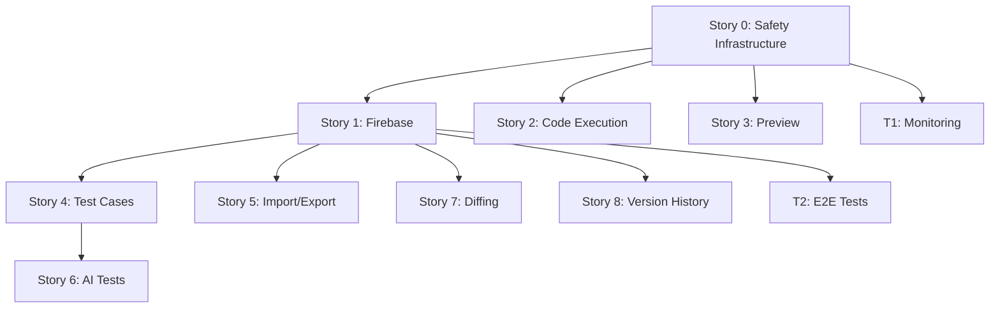

# 4. Epic and Story Structure (UPDATED)

*Last Updated: 2025-01-30*  
*Status: Enhanced with technical specifications and safety measures*

## Epic: Functionality Restoration and Stabilization

**Epic Goal:** To restore the application to a stable, fully-functional state by systematically addressing the feature gaps created during the recent architectural refactoring, while ensuring safe brownfield development practices.

**Epic Status:** IN PLANNING - Sprint 1 Ready

### Epic Enhancements:
- ✅ Complete technical specifications defined
- ✅ Rollback procedures documented
- ✅ Sprint 1 plan created
- ✅ Team structure defined
- ⏳ Awaiting team confirmation

---

## Sprint 1 Stories (Days 1-10)

### Story 0: Safety Infrastructure Setup [NEW - P0]

**Story Type:** Technical Foundation  
**Story Points:** 8  
**Sprint Days:** 1-4

**As a:** Development Team  
**I want:** Comprehensive safety mechanisms in place  
**So that:** We can safely implement changes without risking production stability

**Acceptance Criteria:**
1. Feature flag system operational with instant toggle capability
2. Monitoring dashboard showing real-time metrics
3. CI/CD pipeline with automated testing gates
4. Staging environment mirroring production
5. All 4 rollback levels tested and documented
6. Health check endpoints returning accurate status

**Technical Details:**
- Implement feature flags using Vercel Flags or Unleash
- Configure Sentry for error tracking
- Set up GitHub Actions workflow with safety gates
- Create staging Firebase project
- Document in `/docs/rollback-procedures.md`

**Definition of Done:**
- [ ] Feature flags control all new code paths
- [ ] Monitoring alerts configured and tested
- [ ] CI/CD pipeline running on all PRs
- [ ] Staging deployment successful
- [ ] Rollback completed in < 1 minute
- [ ] Documentation updated

---

### Story 1: Stabilize Firebase Save/Load Functionality [ENHANCED]

**Story Type:** Restoration  
**Story Points:** 13  
**Sprint Days:** 5-7  
**Risk Level:** HIGH  
**Rollback Levels:** All 4 levels implemented

**As a:** User  
**I want:** To save my work to Firebase and load it back without losing data or state  
**So that:** I can trust the system to persist my work

**Acceptance Criteria (Enhanced):**
1. When I click "Save", the entire state (sections, tests, etc.) must be saved to Firebase
2. When I load a configuration from Firebase, the editor must be perfectly restored to its last saved state
3. The UI must provide clear feedback on the save status (e.g., "Last saved at...")
4. **NEW:** Checksum validation prevents corrupted data from loading
5. **NEW:** Dual-write mode ensures backward compatibility
6. **NEW:** Save success rate > 95% measured in monitoring
7. **NEW:** Local backup created on save failure
8. **NEW:** Conflict resolution for concurrent edits

**Technical Implementation:**
```typescript
// Key interfaces from technical-implementation-specs.md
interface SavedConfiguration {
  id: string;
  version: number;
  checksum: string;
  sections: Section[];
  testCases: TestCaseMap;
  tpnSettings: TPNConfig;
  // ... full structure in specs
}
```

**Feature Flags:**
- `useNewFirebaseSave`: Controls new save logic
- `useNewFirebaseLoad`: Controls new load logic  
- `enableDualWrite`: Writes to both old/new structures
- `enableSafeMode`: Extra validation

**Rollback Procedures:**
1. **Level 1:** Toggle feature flags (< 1 min)
2. **Level 2:** Git revert and deploy (< 15 min)
3. **Level 3:** Data migration rollback (< 1 hour)
4. **Level 4:** Full restore from backup (< 4 hours)

**Definition of Done:**
- [ ] All acceptance criteria met
- [ ] Unit tests > 80% coverage
- [ ] Integration tests passing
- [ ] Feature flags implemented
- [ ] Rollback tested at all levels
- [ ] Performance < 1s save, < 500ms load
- [ ] Documentation updated

---

### Story 2: Ensure Correct and Secure Dynamic Text Execution [ENHANCED]

**Story Type:** Restoration  
**Story Points:** 8  
**Sprint Days:** Sprint 2, Days 1-3  
**Risk Level:** CRITICAL (Security)  
**Rollback Levels:** Levels 1-2 primarily

**As a:** User  
**I want:** The JavaScript I write in dynamic sections to be executed correctly and securely, with full access to the TPN context (`me` object)  
**So that:** I can create powerful, data-driven reference texts

**Acceptance Criteria (Enhanced):**
1. When I use `me.getValue('some_key')`, the code must correctly retrieve the value from the active TPN context
2. When my code has an error, the preview must display a clear error message
3. All JavaScript execution must happen within the secure Web Worker sandbox
4. **NEW:** Execution timeout enforced at 5 seconds
5. **NEW:** Memory usage limited to prevent exhaustion
6. **NEW:** Global objects (window, document) inaccessible
7. **NEW:** Console output captured safely
8. **NEW:** Babel transformation successful for modern JS

**Technical Implementation:**
```typescript
// Worker communication protocol
interface WorkerRequest {
  id: string;
  type: 'execute' | 'validate' | 'terminate';
  payload: ExecutionPayload;
  timeout?: number;
}

// Sandboxed context
const me = Object.freeze({
  getValue: (key: string) => { /* ... */ },
  ingredients: Object.freeze([...]),
  populationType: string
});
```

**Security Measures:**
- Frozen context objects
- Removed global access
- Strict mode enforcement
- Timeout protection
- Memory limits

**Definition of Done:**
- [ ] All acceptance criteria met
- [ ] Security audit passed
- [ ] Worker isolation verified
- [ ] Performance < 100ms for simple code
- [ ] Timeout tested with infinite loops
- [ ] Error messages user-friendly

---

### Story 3: Restore Real-Time Live Preview [ENHANCED]

**Story Type:** Restoration  
**Story Points:** 8  
**Sprint Days:** Sprint 2, Days 4-5  
**Risk Level:** MEDIUM  
**Rollback Levels:** Level 1 primarily

**As a:** User  
**I want:** To see the rendered output of my sections update in real-time as I type  
**So that:** I can get immediate feedback on my work

**Acceptance Criteria (Enhanced):**
1. When I edit a static HTML section, the Preview Panel must update instantly
2. When I edit a dynamic JavaScript section, the code must execute and the preview must update instantly
3. When I change a value in the TPN Test Panel, the preview for relevant dynamic sections must immediately re-render
4. **NEW:** Preview updates debounced at 500ms for performance
5. **NEW:** Auto-degrades to manual mode if performance < 200ms
6. **NEW:** Memory usage monitored and controlled
7. **NEW:** Render cache improves repeat performance
8. **NEW:** DOM updates use efficient diffing

**Technical Implementation:**
```typescript
// Preview modes
type PreviewMode = 'realtime' | 'debounced' | 'manual';

// Performance monitoring
interface PreviewMetrics {
  renderCount: number;
  averageRenderTime: number;
  memoryUsage: number;
}
```

**Performance Strategy:**
- LRU cache for renders
- Priority queue for updates
- Morphdom for DOM diffing
- Auto-degradation on poor performance

**Definition of Done:**
- [ ] All acceptance criteria met
- [ ] Performance benchmarks met
- [ ] Auto-degradation tested
- [ ] Memory leaks prevented
- [ ] Smooth user experience

---

### Story 0.1: Component Refactoring - Sidebar [NEW - P0]

**Story Type:** Technical Debt  
**Story Points:** 5  
**Sprint Days:** Day 8  
**Risk Level:** MEDIUM

**As a:** Development Team  
**I want:** To refactor the 4,247-line Sidebar.svelte into manageable components  
**So that:** The code is maintainable and testable

**Acceptance Criteria:**
1. Sidebar.svelte reduced to < 500 lines
2. Extracted components < 300 lines each
3. All functionality preserved
4. No visual regressions
5. Tests updated and passing

**Target Structure:**
```
src/lib/components/sidebar/
├── Sidebar.svelte (< 300 lines)
├── SectionList.svelte (< 200 lines)
├── SectionCard.svelte (< 150 lines)
├── SectionActions.svelte (< 100 lines)
├── ImportExportPanel.svelte (< 200 lines)
└── FirebasePanel.svelte (< 200 lines)
```

**Definition of Done:**
- [ ] Line count targets met
- [ ] Feature flag controls new components
- [ ] Visual regression tests pass
- [ ] Code review approved
- [ ] Performance unchanged or improved

---

## P1 Stories (Sprint 2+)

### Story 4: Restore Test Case Management [UPDATED]

**Story Points:** 8  
**Target Sprint:** Sprint 2, Days 6-8

**Acceptance Criteria (Enhanced):**
1. The UI for managing test cases must be accessible from each dynamic section
2. I must be able to define input variables and the expected output for a test case
3. When a test is run, the system must display a clear "Pass" or "Fail" result
4. **NEW:** Test data structure follows TypeScript interfaces
5. **NEW:** Test execution uses same sandbox as preview
6. **NEW:** Test results persisted with configuration

**Technical Details Added:**
- Test execution timeout: 10 seconds
- Test data validation before save
- Batch test execution with progress

---

### Story 5: Fix Import/Export Functionality [UPDATED]

**Story Points:** 5  
**Target Sprint:** Sprint 2, Days 9-10

**Acceptance Criteria (Enhanced):**
1. Export must generate a JSON file correctly representing all sections
2. Import must correctly parse a valid JSON file and load the content into the editor
3. The process must handle the special delimiters for dynamic text (`[f( ... )]`) correctly
4. **NEW:** Import validates data structure before loading
5. **NEW:** Export includes version for future compatibility
6. **NEW:** Progress indicator for large files

---

## P2 Stories (Sprint 3+)

### Story 6: Re-implement AI-Powered Test Generation

**Story Points:** 13  
**Target Sprint:** Sprint 3
**Dependencies:** Story 4 must be complete

**Acceptance Criteria (Enhanced):**
1. A "Generate Tests" button must be available for dynamic sections
2. Clicking the button must call the backend AI service
3. The UI must display the proposed tests and allow me to select which ones to import
4. **NEW:** Rate limiting prevents API abuse
5. **NEW:** Generated tests validated before display
6. **NEW:** Cost estimation shown to user

---

### Story 7: Restore Ingredient & Config Diffing Tool

**Story Points:** 8  
**Target Sprint:** Sprint 3

**Technical Considerations:**
- Use existing diff library
- Performance optimization for large configs
- Visual diff highlighting

---

### Story 8: Re-implement Version History

**Story Points:** 8  
**Target Sprint:** Sprint 4

**Technical Considerations:**
- Firestore subcollection for versions
- Efficient storage using diffs
- UI for browsing history

---

## New Technical Stories

### Story T1: Implement Monitoring Dashboard [NEW]

**Story Points:** 5  
**Target Sprint:** Sprint 2

**As a:** Development Team  
**I want:** A comprehensive monitoring dashboard  
**So that:** We can track system health and performance

**Acceptance Criteria:**
1. Real-time error tracking
2. Performance metrics displayed
3. Feature flag status visible
4. Firebase operation metrics
5. User activity tracking

---

### Story T2: Create E2E Test Suite [NEW]

**Story Points:** 8  
**Target Sprint:** Sprint 2

**As a:** QA Team  
**I want:** Comprehensive E2E test coverage  
**So that:** We can confidently deploy changes

**Acceptance Criteria:**
1. All P0 user journeys tested
2. Cross-browser testing (Chrome, Firefox, Safari)
3. Mobile responsive testing
4. Performance benchmarks validated
5. Accessibility tests included

---

## Sprint Planning Summary

### Sprint 1 (Current Planning)
- **Focus:** Safety infrastructure + Story 1 (Firebase)
- **Days:** 10
- **Stories:** Story 0, Story 1, Story 0.1
- **Risk Level:** HIGH - Establishing foundation

### Sprint 2 (Projected)
- **Focus:** Core restoration completion
- **Days:** 10
- **Stories:** Story 2, Story 3, Story 4, Story 5, T1, T2
- **Risk Level:** MEDIUM - Building on foundation

### Sprint 3 (Projected)
- **Focus:** Advanced features
- **Days:** 10
- **Stories:** Story 6, Story 7
- **Risk Level:** LOW - Enhancement phase

### Sprint 4 (Projected)
- **Focus:** Polish and optimization
- **Days:** 10
- **Stories:** Story 8, Performance optimization, UI polish
- **Risk Level:** LOW - Refinement phase

---

## Success Metrics

### Sprint 1 Success Criteria
- [ ] Feature flags operational
- [ ] Firebase Save/Load < 5% error rate
- [ ] All rollback levels tested
- [ ] Sidebar refactored
- [ ] Zero production incidents

### Overall Epic Success Criteria
- [ ] All P0 stories complete
- [ ] All P1 stories complete
- [ ] Test coverage > 70%
- [ ] Performance benchmarks met
- [ ] User satisfaction improved
- [ ] Technical debt reduced by 50%

---

## Risk Registry

| Risk | Impact | Probability | Mitigation | Owner |
|------|--------|------------|------------|-------|
| Firebase API changes | HIGH | LOW | Dual-write mode, versioning | Tech Lead |
| Performance degradation | MEDIUM | MEDIUM | Monitoring, auto-degradation | Dev Team |
| Data corruption | CRITICAL | LOW | Checksums, backups | Tech Lead |
| Team availability | HIGH | MEDIUM | Cross-training, documentation | PO |
| Scope creep | MEDIUM | MEDIUM | Clear acceptance criteria | PO |

---

## Dependencies Map



---

*Document Version: 2.0*  
*Last Updated: 2025-01-30*  
*Author: Sarah (Product Owner)*  
*Status: Ready for Sprint 1 Execution*